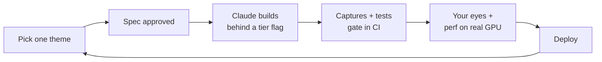

# Solar System Sim — Plan & Iteration Loop

2026-09-24 · @Someone · rewritten for three.js on WebGPU, built by Claude

## The pivot

A test repo built with Rust and Bevy, with Claude writing the code, went badly. This plan replaces that one. Three things change and everything else stays.

**What changes.**

- **The stack.** three.js with `WebGPURenderer`, shaders written in TSL (three.js's node-based shading language), TypeScript, Vite. Browser only. No native build, no wasm, no Rust.
- **Who does the work.** Claude writes the code, the data pipeline, the tests, and the tooling. You direct, decide, and verify. The plan is written for that split. It no longer includes a learning curriculum for you, because you are not the one typing.
- **Performance is a goal, not just a budget.** WebGPU gives us compute shaders, storage buffers, indirect draws, and GPU timestamps. The plan uses them on purpose, and every one gets measured on real hardware.

**What does not change.** The thesis, the world catalogue, one world at a time, no invented terrain, and the story-by-story pace. The detail obsession gets stronger. With an agent writing the code, detail is the only thing standing between "looks right" and "is right".

### Why this stack suits agent-built work

- **One language, one runtime, one loop.** Claude can edit, typecheck, unit test in Node, render in headless Chromium, and read the resulting PNG, all in the same session with no compile wait. Every story below is designed around that loop.
- **The source is on disk.** three.js ships its full source and examples in `node_modules`. Claude reads the pinned version's actual code instead of recalling an API from memory. For TSL this matters a lot, because it is young and changes every month.
- **The browser is the only target.** There is no native-versus-wasm split, and no platform layer that works in one build and fails in the other.
- **The planetary ecosystem is already here.** NASA-AMMOS's 3DTilesRendererJS is used for Mars terrain at JPL, and it is a real candidate to adopt instead of building our own level of detail. See SS-10.

### What it costs

- **TSL is young and changes monthly.** three.js releases about once a month and TSL still breaks between releases. We pin an exact version and upgrade on purpose, never as a side effect of something else.
- **No native profilers.** We get Chrome DevTools and WebGPU timestamp queries, but no RenderDoc or Xcode GPU captures of a native build. That is an acceptable loss.
- **Garbage collection pauses.** JavaScript can hitch when the garbage collector runs. The fix is a render loop that allocates nothing per frame, enforced from SS-3.
- **The GPU still has no f64.** This is the same as before. JavaScript numbers are f64 on the CPU, which makes camera-relative rendering easier than it was in Rust.

### What was checked before writing this

These findings come from a probe run in this repo's cloud container on 2026-09-24. The probe used three r184–r186, Playwright 1.56.1, and Chromium 141. They are facts about today's versions, not guesses.

| Finding | Consequence |
| --- | --- |
| Headless Chromium with SwiftShader flags gives a real WebGPU adapter (`vendor: google`, `architecture: swiftshader`, `isFallbackAdapter: true`). It renders a lit sphere that Claude can capture and look at | The capture-and-look loop works in the cloud. It becomes story SS-2, before any real content |
| Without those flags, `WebGPURenderer` finds no adapter and **silently switches to its WebGL2 backend**. The only sign is a console warning | The app must check `renderer.backend.isWebGPUBackend` after `init()` and refuse to run otherwise |
| three r185.1 and r186 throw `TypeError: … not of type 'GPUTextureComponentSwizzle'` on Chromium 141. r184 works | Upgrade three and Playwright's Chromium together, never one alone |
| The reversed-Z option is spelled `reversedDepthBuffer`. Passing `reverseDepthBuffer` is **silently ignored** | Renderer options go through a typed wrapper, and every option we depend on is proven by a capture |
| `renderAsync()` is deprecated at r184 in favour of `await renderer.init()` then `render()` | Memory of older examples is unreliable. Read the installed source |
| A minimal lit-sphere scene bundles to 730 KB minified, 200 KB gzip, 163 KB brotli (r184) | Sets the initial JS budget below |
| SwiftShader reports `texture-compression-bc`, `-etc2`, `-astc`, `timestamp-query`, `subgroups`, `float32-filterable` | Captures can exercise every texture path. Real devices will report fewer, so capability probing is still required |

## Direction

**Show what we know. Show where we haven't looked yet.**

That is the thesis, and it decides the hard cases. When accuracy and beauty conflict, accuracy wins and the beauty comes from what is actually there. When a dataset runs out, the tool says so rather than inventing a continuation. When something is uncertain, the uncertainty is visible.

It also sets the standard for the whole project, which is not "is this impressive" but "does this teach something true." Those usually agree. Where they do not, the second one wins.

Three things follow directly.

### The hovering constraint is where knowledge ends

Not landing, only hovering close, is the right boundary and it is not an engineering compromise. Global coverage for most worlds tops out between 100 and 500 metres per pixel. Hovering a few kilometres up needs roughly 10 to 50. Landing would need centimetres, which exists almost nowhere.

So the constraint sits exactly where human knowledge sits. You are building to the edge of what has been measured, and stopping there is the honest thing to do as well as the cheap one.

### Vertical exaggeration has to be visible

Real planetary terrain is far flatter than people expect. Olympus Mons is roughly 22 km tall across 600 km of base, a slope of about four percent. Rendered truthfully at a distance it looks like a gentle bulge, and most people find that disappointing.

Every educational tool exaggerates vertically. This one exaggerates and says so on screen, with a factor adjustable down to 1x. That turns a necessary distortion into a lesson about how flat planets really are, which is more interesting than either the lie or the bare truth.

The same rule covers every other honest distortion the renderer makes, starting with star visibility in SS-4. If we change what physics would show, the screen says so.

### Gaps are the most valuable content in the project

This is the part that makes the whole thing worth doing rather than redundant.

Coverage across the solar system is wildly uneven, and almost nothing communicates that. Pluto's encounter hemisphere was imaged at around 300 metres per pixel while the far side got 13 to 27 kilometres, a factor of forty across one world, with everything below about 38 degrees south unlit during the flyby. Venus has 75-metre radar imagery over topography 60 times coarser: detailed pictures of a surface whose shape we barely know. Some hemispheres of the Uranian moons have never been photographed by anything.

Showing that honestly, with the mission and year attached, teaches something no amount of invented terrain could. It also makes the tool a living document: every future mission fills in a region, and the difference between the old and new state is itself the story of exploration.

By contrast, the usual approach fills unmapped regions with plausible invented landscape. That is the one thing this project will not do. It is also the thing an agent is most likely to do by accident, because procedural noise is its easiest way to make a gap look finished. `CLAUDE.md` forbids it explicitly (see SS-1).

### Working in the open

If the point is letting other people learn, then the learning should be visible while it happens rather than only at the end.

That means devlogs as you go, the data pipeline public, and notes on what each dataset turned out to actually be like once you opened it. Those notes are genuinely scarce: the practical experience of wrangling planetary data is scattered across papers and mailing lists, and writing it down plainly is a contribution independent of whether the renderer ever ships.

Agent-built work adds a second thing worth showing: the specs, the checks, and the mistakes the checks caught. A public record of how an AI-built science tool was kept honest is useful to people who will never care about the Moon.

It also happens to be what sustains long solo projects. A small number of people following along is more durable fuel than a launch.

### What data actually exists

Nearly everything is public domain and lives at NASA and USGS. The [Astropedia catalog](https://astrogeology.usgs.gov/search) is the main portal, with the Planetary Data System behind it. Figures below are global coverage; spot coverage is often far better.

| World | Best global topography | Best global imagery | The honest gap |
| --- | --- | --- | --- |
| Earth | Copernicus GLO-30, 30 m | Sentinel-2, sub-10 m | Ocean floor is mostly interpolated, not measured |
| Moon | [LOLA, 118 m](https://astrogeology.usgs.gov/search/details/Moon/LRO/LOLA/Lunar_LRO_LOLA_Global_LDEM_118m_Mar2014/cub) | LRO WAC, 100 m | Permanently shadowed polar craters are unlit |
| Mars | [HRSC-MOLA blend, 200 m](https://astrogeology.usgs.gov/search/map/Mars/Topography/HRSC_MOLA_Blend/Mars_HRSC_MOLA_BlendDEM_Global_200mp) | CTX, about 6 m | Best-mapped world after Earth and the Moon |
| Mercury | MESSENGER, about 665 m | [MDIS basemap, 166 m](https://astrogeology.usgs.gov/search/map/Mercury/Messenger/Global/Mercury_MESSENGER_MDIS_Basemap_LOI_Mosaic_Global_166m) | South polar region weaker than the north |
| Venus | [Magellan, 4,641 m](https://astrogeology.usgs.gov/search/map/venus_magellan_global_topography_4641m) | [Magellan SAR, 75 m](https://astrogeology.usgs.gov/search/map/venus_magellan_sar_fmap_left_look_global_mosaic_75m) | Radar, not optical; relief 60x coarser than imagery |
| Galilean moons | Sparse, local only | Galileo and Voyager, km-scale | Patchy 1980s and 1990s flyby coverage |
| Titan | Cassini RADAR, local patches | Obscured by haze | Surface visible only to radar and infrared |
| Enceladus | Cassini, encounter hemispheres | Cassini, good where covered | Coverage uneven by hemisphere |
| Pluto | Limited stereo, encounter side | [300 m near side, 13 to 27 km far side](https://arxiv.org/pdf/1510.07704) | Below about 38 degrees south was unlit |
| Uranus and Neptune moons | Essentially none | Voyager 2, 1986 and 1989 | Some hemispheres have never been imaged |
| Gas and ice giants | No surface exists | Cloud tops only | A different rendering problem entirely |

Two consequences worth planning around now.

The gas giants are not a later story in the same pipeline. They have no terrain, and rendering banded volumetric cloud tops shares almost no code with a displaced sphere. Treat them as a separate system, scheduled separately, and do not let the terrain work pretend it will eventually cover them.

The data volume is a project in its own right. Full-resolution Mars CTX is measured in terabytes. You will preprocess each source into your own tile pyramid, host it on object storage, and stream it to the browser. Budget real time for that pipeline, and prefer a host where egress is free, because egress is what makes this expensive rather than storage.

There is one more practical constraint. Claude's cloud sessions reach the internet through the environment's network policy. If a USGS or PDS host is blocked, either the host gets allowlisted in the environment settings or the download step runs on your machine. Either way, downloads are scripted and checksummed so that where they ran does not matter.

Every body worth rendering, sorted into four tiers by how much data exists, is catalogued in the [World catalogue](docs/world-catalogue.md). Every row carries a status, so that file is the single answer to which worlds are supported. Tier 1 and Tier 2 together are twenty-five bodies and a realistic multi-year target.

## Vision and principles

When this is done, someone should come away feeling how large the solar system is, how detailed each world is, and curious enough to go read something. Detail and physics are the means. Those goals usually agree with accuracy, and where they do not, the Direction section decides: truth wins, and the feeling has to come from what is actually there.

### Own few layers, adopt the rest

Apple does not build everything. They run on an instruction set they licensed, a kernel they inherited, and chips someone else fabricates. What they actually do is pick a small number of layers to own completely and refuse to own the rest.

That discipline matters just as much when an agent writes the code. Claude can produce a bespoke version of anything, and every bespoke layer is one more thing you have to verify. The cost of owning something moved from typing it to trusting it.

| Layer | Decision | Why |
| --- | --- | --- |
| Renderer | Adopt three.js `WebGPURenderer`, pinned | Scene graph, materials, loaders, and a WebGPU backend exist and are maintained. Writing our own is a different project |
| Shading | Adopt TSL; raw WGSL only through `wgslFn` for hot kernels | TSL is the only shading path `WebGPURenderer` supports. GLSL `ShaderMaterial` does not run on it |
| Ephemerides | Adopt SPICE kernels, evaluated offline with SpiceyPy | JPL's measured data beats anything we would integrate ourselves |
| Raster reprojection | Adopt GDAL, via rasterio's bundled wheels | Decades of map-projection edge cases, and no system install to break |
| Texture transcoding | Adopt KTX2 + Basis via three's `KTX2Loader` | One file per texture, transcoded to whatever the adapter supports |
| Terrain LOD and streaming | Spike 3DTilesRendererJS first, build only if it fails (SS-10) | It already handles ellipsoids and planetary bodies. Building ours is the largest single cost in the plan |
| Camera and scale handling | Build | How movement feels from orbit down to hovering is the experience |
| Lighting, photometry, exposure | Build | Correct radiometry from Mercury to Neptune is unusual, and it is our differentiator |
| Per-world data pipeline | Build | Repeatable, scripted, and reused twenty times |
| Verification harness | Build, first | It is what makes agent output trustworthy. See SS-2 |
| Art direction and interface | Build, and you decide | Nobody can give you this, including Claude |

**Ephemerides move offline.** The Rust plan read SPICE kernels in the browser. The new plan runs SpiceyPy in the pipeline and ships compact per-world ephemeris files: fitted Chebyshev series over a fixed date range, with the fit error asserted against SPICE in the pipeline's tests. A small pure-TypeScript evaluator in `core/` reads them at runtime. This keeps megabytes of kernels and a wasm CSPICE out of the page. If we ever need arbitrary SPICE queries at runtime, TimeCraftJS (CSPICE compiled to wasm, from NASA-AMMOS) is the fallback.

### What "physics" means here

Worth scoping carefully, because the intuitive answer is wrong in a useful way.

**Optics and radiometry matter most.** Correct solar intensity falling off with distance, correct exposure, a physically-grounded terminator, accurate shadow geometry. This is what makes a render feel real rather than rendered.

**Geometry matters and is mostly adopted.** Positions, rotation, axial tilt, precession, libration, eclipse alignment. SPICE gives you all of it at professional accuracy.

**Dynamics matter least, which is counterintuitive.** For a science tool you do not simulate gravity, you replay measured reality. Any n-body integrator we write will be less accurate than the JPL ephemerides it is trying to reproduce. Simulated dynamics earn their place only as explicit educational toggles, where showing why something orbits is the point rather than where it is.

**Atmospheric radiative transfer is the one genuinely hard simulation** you will want, and only for Earth, Mars, Titan, and Venus. It is also where WebGPU compute pays off most: precomputed scattering lookup tables, of the Bruneton kind, are built by compute passes at load.

### One world at a time

There is no continuous flight between worlds. You pick a world and arrive there. Each world is a self-contained scene, loaded on entry and discarded on exit.

This is a better trade than it first appears, because the two transitions are not equally valuable. Whole-planet down to a single crater is the one that produces the feeling. Crossing interplanetary space is mostly waiting, and rendered honestly it is empty in a way that reads as boring rather than vast. Cutting the second while keeping the first keeps almost all of the emotional payload for a fraction of the work.

What it costs is system-scale awe, which has to be carried somewhere else. Three places to put it:

- **The selector itself.** If choosing a world happens on an honest true-scale diagram, with distances and light-travel times shown, the selection screen teaches the thing the flight would have.
- **Comparison.** Ganymede beside our Moon at the same scale says more about the outer system than an hour of travel would.
- **Within a world.** Continuity from orbit down to hovering stays, and that is where scale actually lands. Olympus Mons only becomes real when the horizon curves away beneath you.

### What this buys technically

More than the earlier simplifications, and it is worth being explicit because it changes the risk profile of the whole project.

- **No floating origin.** Each world is its own scene in its own local frame. Camera-relative rendering (SS-11) handles hovering precision without it, and JavaScript's f64 numbers make that simple on the CPU.
- **One world resident at a time.** Loading on entry and discarding on exit keeps the browser memory ceiling tractable, since the budget covers one body rather than a solar system. In three.js "discarding" means calling `dispose()` on every geometry, material, texture, and render target. Our own GPU memory accounting (see Budgets) is what proves it actually happened.
- **Loading becomes legitimate.** World selection is a natural place for a progress indicator. It is also the right moment to precompile every pipeline with `renderer.compileAsync`, so the first frame does not stutter on shader compilation.
- **Worlds become independently shippable.** Each is a data manifest plus a scene, testable alone and releasable alone. That maps exactly onto one world per release.

The last point is the most valuable. It turns an open-ended detail project into a queue of finite, similar units of work, which is the shape a multi-year effort needs to stay finishable. It is also the shape an agent is best at: a well-specified, repeated unit with a checklist.

### A world is never alone

One world at a time does not mean one object in the scene. Standing at the Moon without Earth in the sky would be wrong in a way people feel immediately, and for the outer moons the neighbour is the whole point of being there.

Each world's scene therefore carries a list of context bodies: nearby significant objects rendered in the background at their real positions, sizes, and phases.

The good news is that this is cheap. A context body needs no terrain, no level of detail, and no streaming, because it is far away and subtends a fixed angle. One low-resolution textured sphere, positioned correctly and lit by the same sun, is the entire implementation. It costs almost nothing against the main world's budget.

Apparent sizes, computed from mean orbital distances and rounded, with our own Moon's half-degree as the yardstick:

| Standing at | Dominant neighbour | Apparent diameter | Versus our Moon |
| --- | --- | --- | --- |
| Phobos | Mars | about 40° | about 76x |
| Enceladus | Saturn | about 28° | about 53x |
| Io | Jupiter | about 19° | about 36x |
| Europa | Jupiter | about 12° | about 23x |
| Ganymede | Jupiter | about 7.5° | about 14x |
| Charon | Pluto | about 7° | about 13x |
| Titan | Saturn | about 5.5° | about 11x |
| The Moon | Earth | about 1.9° | about 3.7x |

Those numbers are the goosebumps. Jupiter from Io fills a fifth of the sky, and Mars from Phobos fills nearly half of it. No amount of terrain detail produces that reaction; correct geometry does it for free.

Every row in that table becomes a unit test once context bodies exist. The rounded figures above are for the plan. The test computes the value from the ephemeris and checks it against the published one.

### What correctness gives you here

Positioning context bodies is exactly what SPICE is for, so adopting it pays off a second time. Where Earth sits as seen from a point above the Moon at a given epoch comes out of the same precomputed ephemeris file as everything else.

Three things fall out of doing it properly, and each is worth more than a paragraph of explanatory text:

- **Phases are complementary.** Light the context body with the same sun and Earth shows a phase opposite to the Moon's as seen from home. Full Moon means new Earth. Nobody expects this and everybody likes it.
- **Earth does not move in the lunar sky.** Tidal locking holds it near a fixed point, wobbling a few degrees with libration, never rising and never setting. From the far side it is simply never there. That is a whole lesson delivered by geometry alone.
- **Eclipses happen on their own.** A moon passing into its parent's shadow is dramatic, real, and requires no special code once positions and lighting are correct.

One rule keeps the body list from growing without limit: render a neighbour as a sphere when its apparent diameter is large enough to resolve, and leave everything smaller to the star catalogue as a bright point. Mars seen from Jupiter is a dot, and treating it as one is both cheaper and more truthful.

## The orbital view

A user-placed station in a configurable orbit, watched in third person, is the strongest single idea in this plan. It supplies the verb the project was missing. Everything else is looking; this is doing, and it is doing something that teaches the least intuitive subject in the whole domain.

It also fits the per-world architecture exactly. A station orbits one body, which is already the scope of a scene.

### This reverses the earlier advice on dynamics

The principles section says dynamics matter least, because measured ephemerides beat anything you would integrate. That is right for planets and wrong for this.

A station the user placed has no ephemeris. Nobody measured it. Its motion has to be simulated, and that makes this the one place where real orbital mechanics genuinely earns its keep rather than duplicating better data.

What that actually requires is less than it sounds:

- **Two-body Keplerian propagation** is enough for the viewing experience. Analytic, stable over arbitrary time, cheap, and exactly scrubbable forwards and backwards, which a numerical integrator is not.
- **Impulsive burns** rather than continuous thrust. Apply an instantaneous velocity change, recompute the orbital elements, carry on propagating. This is how real mission planning works and it avoids needing an integrator at all.
- **J2 oblateness** is the one perturbation worth adding later. It causes orbital planes to precess, which is why sun-synchronous orbits exist, and it is a genuinely beautiful thing to let someone discover.
- **Atmospheric drag** only matters for low orbits at Earth, Mars, Venus, and Titan, and only if you want decay to be visible.

Continuous-thrust integration is the thing to avoid. It costs numerical stability, breaks time scrubbing, and buys almost nothing a burn model does not already give you.

This is also the code most at risk from confident, plausible, subtly wrong agent output. Kepler's equation near e = 1, the anomaly conversions, and the element singularities at zero inclination and zero eccentricity are exactly where that happens. The propagator lives in `core/`, and it ships only with the conservation and round-trip tests listed under validation.

### Why the Apple TV shots work

Worth copying deliberately rather than by feel, because the ingredients are specific.

The station structure sits in frame the whole time. It is not decoration; it is the scale reference that makes the planet read as enormous. This is the same principle as putting a known object beside an unknown one, and it is why those shots feel vast where a bare planet does not.

The motion is slow and continuous, the terminator slides past rather than sitting still, and the night side carries its own detail. Cutting, fast motion, and interface chrome all destroy the effect.

So build a cinematic mode as a real mode: no interface, slow camera arm, long uninterrupted takes. It is close to free once the orbit propagates, and it is the thing people will leave running.

### Keep the first version to two controls

Six orbital elements is too many for anyone meeting orbits for the first time, and a six-slider panel will read as an engineering tool rather than an invitation.

Start with altitude and inclination. Two sliders produce every view worth seeing, from a low fast equatorial pass to a slow polar orbit crossing the terminator each time around. Eccentricity, argument of periapsis, and the rest can arrive with the thruster work, where changing them is the point.

The third-person camera needs one early decision: whether it holds steady relative to the station or relative to the planet below. The first reads as a spacecraft, the second as a flyover. Both are worth having, and they feel completely different.

### The design mini-game is a separate project

Building a station from parts is a construction game. That is a different genre with its own physics, its own interface problems, and its own years of work, and it is the part of this plan most likely to quietly consume everything else.

Agent speed makes this more dangerous, not less. A parts editor is exactly the kind of thing Claude can produce a convincing first version of in an afternoon, and then it needs maintaining forever. Schedule it the way the gas giants are scheduled: as its own project, started only once the orbital view is finished and people are actually using it. A single well-modelled station is enough for a long time.

### Sequencing by what you want to see

With Claude doing the building, ordering the backlog by "what do I want to learn next" becomes "what do I want to see next, and understand properly". That is still a legitimate way to order work, alongside product logic.

Use it deliberately rather than accidentally. A story pulled forward because it will show you something true is a good decision. A story pulled forward because it is more fun than the one being avoided is how the middle of a project rots. That happens just as easily when someone else is doing the typing.

## How we work: Claude builds, you direct and verify

This section replaces the old advice to delegate only what you already understand. You chose to delegate nearly everything, which is a reasonable choice. It only works if every piece of delegated work comes back with evidence that does not depend on trusting the agent.

### Who does what

| You | Claude |
| --- | --- |
| Pick the next story | Expand it into a full spec before writing any code |
| Approve or amend the spec | Implement it on a branch, one pull request per story |
| Make the calls marked *Your decision* | Lay out the options for those calls, with evidence, and never pick one silently |
| Judge the eyes-on criteria on your own hardware | Attach captures, diffs, test output, and budget numbers to every PR |
| Sign off anything checked against ground truth | Cite the dataset documentation for every convention it relies on |
| Run the performance baseline on a real GPU | Keep the harness, CI, and pipeline working |
| Merge | Record actual effort against the estimate in the story file |

### The story contract

Every story below is a sketch. Before any code, Claude turns it into `docs/stories/SS-n.md` with these sections, and you approve it. Most of the detail obsession happens here, where changes are cheap.

1. **User story and acceptance criteria.** Every criterion is checkable, and each one is marked *machine* (a test or capture decides) or *eyes* (you decide).
2. **Ground truth.** The external source each truth claim is checked against: JPL Horizons, the IAU Gazetteer, SIMBAD, a dataset's own label file, or a real photograph. "Claude says so" is never a ground truth.
3. **Traps.** The ways this story could look right and be wrong, written down before the code. Each trap gets a test or a capture that would catch it.
4. **Canonical captures added.** New viewpoints joining the regression set.
5. **Budget impact.** Expected bytes, GPU memory, and frame time, and afterwards the measured numbers.
6. **Out of scope.** What this story will not do, so the PR cannot quietly grow.
7. **Decisions.** Anything marked *Your decision*, with the options and a recommendation.

### Rules Claude works under

These go into `CLAUDE.md` in SS-1, so every session inherits them.

- **Read the installed source.** For three.js APIs, the pinned version in `node_modules/three` is authoritative, including its `examples/jsm`. Memory of older versions is not.
- **Cite conventions.** Longitude sign, latitude definition, vertical datum, projection parameters, body frame, and units are cited from the dataset's own label or documentation in the PR, every time.
- **Never invent data.** No procedural noise, hallucinated coordinates, or gap-filling. A missing value is a visible missing value.
- **Never tune a check to pass.** Tolerances and thresholds change only with your approval in the PR description. The same goes for skipping or loosening tests.
- **Baselines change deliberately.** Capture baselines are updated only by `npm run capture:accept`, in a commit of their own, with before and after images in the PR.
- **Say what was not verified.** A PR lists what was checked by machine, what needs your eyes, and what was not checked at all.

### Why the harness is the second story

Agent speed shifts where the work is. Producing code is cheap now; knowing it is correct is the whole job. A check that runs in CI turns agent output from something you have to read carefully into something you can test. That is why SS-2 builds the capture harness before anything real is on screen.

One caution specific to this domain. Planetary data conventions are sparsely represented in training data and confidently guessed at: longitude sign, latitude definition, vertical datum, body frame, projection parameters. Claude will guess them fluently. The citation rule above exists for exactly this reason, and it applies to every PR regardless of how obvious the convention looks.

### What stays yours

Three kinds of work can't be delegated, because they are the project itself:

- **What a world should feel like.** Pace, framing, what the camera does on arrival.
- **Where a distortion is honest.** Vertical exaggeration, star visibility, exposure. Each one is a judgement about truth.
- **Which detail earns its cost.** Claude can tell you what a feature costs in milliseconds and megabytes. Whether it is worth it is your call.

## Scope

The MVP is the Moon as a real sphere, wrapped in real LRO imagery, lit by a real sun angle, that you can rotate and look at, running on WebGPU in a browser tab. No elevation yet, no other worlds, no solar system. Nobody sees it but you.

The Moon should be the first world, not Earth. Its data is uniform, global, and excellent, and it has no atmosphere, no ocean, no clouds, no weather, no vegetation, and no seasons. Earth needs four additional rendering systems before it looks right at all, and every one of them is a place to get stuck. The Moon looks correct the moment the texture loads, and everybody recognises it instantly.

Mars is the natural second world, since its data is nearly as good and its terrain is far more dramatic.

Worlds are reproduced, never invented. Where data does not exist, the tool shows that it does not exist rather than filling the gap with plausible-looking noise.

In scope for Release 1:

- A three.js app on WebGPU in a browser tab, refusing to run on anything else
- A headless capture harness Claude can run and read, gating every PR
- A starfield backdrop from a real catalogue
- The Moon as a sphere with a real LRO WAC mosaic, downsampled to fit the budget
- Correct sun direction for a real epoch, producing a real terminator
- Drag to rotate, scroll to zoom, no closer than a distant orbital view
- A debug overlay with frame-time percentiles, from the first frame onward

Not in Release 1:

- Elevation, displacement, or any terrain relief
- Level of detail, tile streaming, or hovering close
- Any other world
- Orbits, time controls, or the solar system
- Labels, UI, or educational text
- Public deployment

Nothing is published until you say so.

Release 1 deliberately ships a sphere with no relief. That sounds like a cop-out and is not. It proves the data path end to end, from a NASA archive to a pixel in a browser, and it proves the verification loop Claude will depend on for every story after. Those are the two parts of this project most likely to surprise you. Displacement is the next release and is comparatively easy once both exist.

## Decisions to lock before code

These are expensive to reverse once there is a codebase. Everything else can be decided later by writing code and seeing what happens.

| Decision | Choice | Why it can't wait |
| --- | --- | --- |
| Render backend | `WebGPURenderer`, WebGPU backend only; the WebGL2 fallback is detected and refused | WebGL2 has no compute. Allowing the silent fallback means some users get a different renderer that nobody tested |
| Shading | TSL only; `wgslFn` for hand-written hot paths | It is the only shading path the renderer supports, and mixing approaches doubles the surface area to verify |
| three.js version | Exact pin, no caret; upgraded together with Playwright's Chromium in a PR of its own | TSL changes monthly, and the probe showed version skew breaking rendering outright |
| Language and tooling | TypeScript `strict` with `noUncheckedIndexedAccess`, Vite, Vitest, Playwright, ESLint, Prettier; Node pinned | Strict types catch agent mistakes before a human has to. Retrofitting strictness later is a rewrite of every file |
| Module boundary | `core/` is pure TypeScript and may not import `three`, enforced by lint; ephemeris, orbits, geodesy, photometry, and tile maths live there | This is the successor to the Bevy-free crates. It keeps truth-critical code testable in Node in milliseconds, and immune to three.js upgrades |
| Scene frame | Per-world inertial frame: axes aligned to ICRF/J2000, origin at the world's centre. The world rotates within it; stars are fixed | Stars, sun, and context bodies all come from SPICE in J2000. A body-fixed scene frame would rotate the whole sky every frame |
| Axis mapping | One tested function maps ICRF (Z to the celestial north pole) to three.js's Y-up space. A test asserts its determinant is +1 | A permutation with determinant −1 is a mirror, and it produces a sky that looks fine and is backwards |
| Units | Kilometres, f64 on the CPU, camera-relative f32 on the GPU | SPICE works in km, and km are readable in overlays and test failures. The earlier "planet radius as unit" choice made heights unreadable |
| Depth | Reversed-Z (`reversedDepthBuffer: true`), proven by a capture | Naive depth fails at planetary scale. The option name has already been shown to fail silently |
| Ephemerides | Offline SpiceyPy to per-world Chebyshev files; a pure-TS evaluator in `core/` | Keeps kernels and CSPICE out of the page, and makes the runtime testable against Horizons |
| Asset delivery | Your own tile pyramid on object storage, streamed; textures as KTX2 | Source archives are terabytes; nothing usable can be bundled with the app |
| Data provenance | Source, product ID, version, mission, resolution, and processing steps recorded per asset and per tile | An education tool has to cite itself, and the coverage overlay (SS-16) is impossible to retrofit without it |
| Memory budget | One world resident at a time, disposed on exit, and proven by GPU memory accounting | Budgeting for a single body rather than a system is what keeps the browser ceiling reachable |
| Preprocessing | Scripted from the first world, deterministic, checksummed; Python managed by `uv` with a lockfile | It runs for twenty worlds and in cloud sessions. Manual steps make each world cost the same as the first |

Three of these deserve a note.

The WebGPU-only call costs users on old browsers and buys the entire compute half of the project. As of this writing WebGPU ships by default in Chrome and Edge, in Safari from version 26, and in Firefox on some platforms, with more rolling out. The exact matrix is checked at SS-12, not assumed. Unsupported browsers get a clear upgrade message, never a degraded renderer. The same gate rejects a software fallback adapter in production, because SwiftShader is fine for captures and unusably slow for people.

The `core/` boundary pays off most over years. Every truth claim in this project, from where the sun is to how bright the regolith appears, is a pure function that can be tested against ground truth without a GPU. Claude can iterate on it in seconds, and three.js upgrades cannot touch it.

The axis-mapping test looks paranoid, and it is the cheapest insurance in the plan. A mirrored sky or a mirrored Moon is the classic error in this domain, and to anyone who has not memorised Orion it looks completely correct.

## Release 1 backlog — a frame with a sun

Six stories. You are the only user of all six, which is exactly right for a first release. There is no point inventing a visitor who does not exist yet.

**Definition of done, applied to every story:** the spec in `docs/stories/` was approved before code; the PR is merged with CI green (typecheck, lint, unit tests, build, captures); captures and measured budget numbers are attached; every *eyes* criterion has been checked by you in your own browser on real hardware; the actual effort is recorded. Nothing is public.

IDs are renumbered here because the stack changed before any code landed in this repo. From this point they freeze, and later changes get suffixes instead.

### SS-1 · A WebGPU frame, and nothing else

As the director, I want a TypeScript app that clears a real WebGPU canvas to a colour I chose, and refuses to run on anything else, so that the stack and its guard rails exist before anything is at stake.

- [ ] Vite + TypeScript scaffold, `strict` and `noUncheckedIndexedAccess` on; ESLint, Prettier, Vitest configured; Node version pinned in `.nvmrc` and `engines`
- [ ] `three` pinned to an exact version, with matching `@types/three`, and the lockfile committed. Choose the newest revision that renders under the Playwright Chromium we pin (r184 as of the probe)
- [ ] `npm run dev` shows a canvas cleared to a non-default, non-black colour, so a successful clear can't be mistaken for a failure
- [ ] After `await renderer.init()`, the app asserts `renderer.backend.isWebGPUBackend`. On failure it disposes the renderer and shows a message naming the actual reason: no `navigator.gpu`, no adapter, or a fallback adapter
- [ ] Renderer construction goes through one typed factory, so a misspelled option is a type error rather than a silent no-op
- [ ] Adapter info (vendor, architecture, `isFallbackAdapter`), enabled features, and the limits we depend on are logged once at startup
- [ ] Canvas handles resize and devicePixelRatio, with DPR capped at 2
- [ ] `CLAUDE.md` holds the rules from "How we work"
- [ ] A SessionStart hook installs dependencies, so every cloud session can run the checks from its first turn
- [ ] GitHub Actions runs install, typecheck, lint, unit tests, and build on every PR
- [ ] `core/` exists with a lint rule forbidding `three` imports, proven by a deliberately failing fixture

Traps: the silent WebGL2 fallback; silently ignored renderer options; examples in memory using the deprecated `renderAsync()`; `@types/three` lagging the runtime version and describing an API that is not there.

Estimate: 1 session. Your review: about 30 minutes, mostly the `CLAUDE.md` wording.

### SS-2 · Claude can see it

As the director, I want Claude to render the app headlessly and read the image, so that "does this look right" is checkable in every later story without me at the desk.

- [ ] `npm run capture -- <viewpoint>` launches Playwright's Chromium with the SwiftShader WebGPU flags, opens the app with `?capture=<viewpoint>`, and writes `captures/<viewpoint>.png`
- [ ] Each capture writes a JSON sidecar: git SHA, three revision, Chromium version, adapter info, canvas size, epoch, and camera pose
- [ ] The capture waits for an explicit ready signal from the app, sent after assets are uploaded and the frame's GPU work has completed. It never waits on a fixed timeout
- [ ] The capture refuses to write if the backend isn't WebGPU or the adapter isn't the expected SwiftShader one
- [ ] Captures are deterministic: fixed canvas size at DPR 1, time taken from the URL rather than the clock, no animation. Two consecutive runs on one machine are compared, and the result is recorded: identical pixels, or the measured tolerance
- [ ] `npm run capture:diff` compares against `baselines/` with a perceptual metric that tolerates anti-aliasing, writes a diff image, and exits non-zero past tolerance
- [ ] `npm run capture:accept` is the only way to update baselines
- [ ] CI runs every canonical capture on every PR and uploads captures and diffs as artifacts
- [ ] Canonical viewpoint 0 is the SS-1 clear colour. It proves the harness end to end before there is anything worth looking at

Traps: three.js and Chromium version skew (r185.1+ against Chromium 141); SwiftShader timings mistaken for performance data; a capture taken before textures finish uploading, which is the classic flaky blank frame; the production adapter gate accidentally blocking capture mode, or capture mode leaking into production.

What this does not do is measure performance. SwiftShader runs on the CPU and its timings mean nothing. Performance comes from real GPUs; see the harness section.

Estimate: 1 to 2 sessions.

### SS-3 · A camera, a cube, and a clock

As the director, I want a 3D camera, a test cube, orbit controls, and a frame-time overlay, so that there is a reference object and a real measurement before anything real is on screen.

- [ ] A perspective camera at a known pose looks at the origin. A lit test cube there is visibly three-dimensional
- [ ] Units are kilometres, declared once in `core/units.ts`
- [ ] Reversed-Z is enabled through the typed factory and proven by a canonical capture: two coplanar-looking quads 10 m apart, seen from 10,000 km, occlude correctly with no z-fighting. The same capture with reversed-Z off must fail, which proves the capture tests the right thing
- [ ] Drag rotates, scroll zooms, within limits. three's `OrbitControls` is fine for now; the real camera is SS-11
- [ ] `?debug` overlay: frame-time histogram over a rolling 300 frames, with p50, p95, and p99; GPU time from timestamp queries where the adapter supports them, with the overlay saying so when it doesn't; draw calls and triangles from `renderer.info`; JS heap where the browser exposes it
- [ ] The render loop allocates nothing per frame: no `new`, no closures, no array literals. Checked by a Playwright test that samples heap allocations over 600 frames through the Chrome DevTools Protocol
- [ ] Uses `renderer.setAnimationLoop`, not a hand-rolled `requestAnimationFrame`

The cube is scaffolding and gets deleted in SS-6. Put it there anyway. Debugging an empty black screen with no reference object is miserable, and you cannot tell an empty scene from a broken camera. That goes double for a capture read by an agent.

Traps: the reversed-Z option spelled wrong and silently ignored, which the paired failing capture exists to catch; a mean frame time that hides hitches; timestamp queries assumed to be available everywhere.

Estimate: 1 session.

### SS-4 · Stars behind everything

As the director, I want a starfield from a real catalogue, correctly oriented, so that the scene reads as space and the sky itself is the first thing the tool gets provably right.

- [ ] `pipeline/stars.py` converts the Yale Bright Star Catalogue (5th revised edition) into a compact binary: a J2000 unit vector, V magnitude, and B–V colour index per star. The catalogue's handful of non-stellar entries are dropped and counted in the output log
- [ ] The conversion is deterministic, and the output checksum is recorded in the manifest
- [ ] All stars render in one draw call, from a storage buffer or as instances, at infinite distance: only the camera's rotation affects them
- [ ] Brightness follows flux ∝ 10^(−0.4·m). Colour comes from B–V through a published colour-temperature relation, which the spec cites. Point size is fixed in pixels and never scales with zoom
- [ ] The background is true black, with no ambient light anywhere in the scene
- [ ] ICRF-to-scene mapping uses the one tested axis function from the decisions table
- [ ] Proper motion is ignored, and the spec says so and quantifies the error over the date range we support

Ground truth, all *machine*:

- Angular separations between a handful of bright pairs, such as Betelgeuse–Rigel and Dubhe–Merak, computed from our binary and compared to separations computed from SIMBAD coordinates written into the test
- Polaris sits within one degree of the scene's celestial north pole
- A canonical capture of Orion with celestial north up: Betelgeuse upper left, Rigel lower right, and the belt running Alnitak, Alnilam, Mintaka from east (left) to west. A mirrored sky fails this capture and nothing else

**Your decision: stars and exposure.** In reality you cannot see stars and a sunlit Moon in the same exposure. Every Apollo surface photograph shows a black sky. The honest options are (a) physical exposure, where stars vanish whenever sunlit ground is in frame; (b) a labelled star boost, following the vertical-exaggeration rule, where stars are drawn brighter than physics allows and the screen says so; or (c) both, as a toggle. The recommendation is (c), defaulting to physical, because the disappearing sky is itself a lesson. This decision is made in SS-4's spec and applied in SS-6.

Estimate: 1 to 2 sessions.

### SS-5 · The Moon's data, scripted

As the director, I want the Moon's imagery and a real sun direction produced by a script anyone can re-run, so that the data half of the pipeline is proven and repeatable before any of it is rendered.

This used to be half of one story. It is now a story of its own because it is the largest and least glamorous piece of Release 1, and the easiest to fake.

- [ ] `pipeline/` is a Python project managed by `uv` with a lockfile. GDAL comes from rasterio's bundled wheels, so no system install is needed, and the GDAL version is recorded in every output manifest
- [ ] The download is scripted, resumable, and checksummed, with the source URL, product ID, and version recorded. If the cloud environment's network policy blocks the host, the spec says so and the step runs on your machine. The rest of the pipeline is unchanged either way
- [ ] Output is an equirectangular texture: planetocentric latitude, east-positive longitude, with the convention cited from the product label
- [ ] Texture size and format are chosen by measurement, not assumption. The default WebGPU `maxTextureDimension2D` limit is 8192, which gives about 1.3 km per pixel on the Moon. The Moon's albedo is essentially one channel, so an R8 texture is a quarter of the memory of RGBA8. The spec compares the candidate formats for download size, GPU memory including mips, and decode time. The download stays under 6 MB
- [ ] The transfer function is explicit. If 8-bit values are stored with an sRGB curve to preserve dark detail, the texture is tagged sRGB so the GPU linearises it exactly once
- [ ] `worlds/moon/manifest.json` records the body, NAIF ID (301), the radius read from the PCK kernel rather than typed in, the body-fixed frame, every product with its provenance, the processing steps, and output checksums
- [ ] SpiceyPy produces the sun direction and the Moon's orientation, J2000 to the body-fixed frame, for a small set of canonical epochs. At least one of those is near full Moon and one near first quarter
- [ ] Re-running the pipeline produces byte-identical outputs

Ground truth, all *machine*:

- The sub-solar point on the Moon at each canonical epoch matches JPL Horizons' sub-solar longitude and latitude to within 0.1°
- Sampling the texture at IAU Gazetteer coordinates, cited in the test, gives what we expect: Mare Crisium darker than the surrounding highlands, Tycho's centre bright, and the Apollo 11 site in Mare Tranquillitatis

Traps worth naming now, because each one produces a Moon that looks fine:

- **Baked-in shading.** LROC's WAC *morphologic* mosaic was assembled from images taken at moderate-to-high sun angles, deliberately, to show relief. Light it with a real sun and every crater gets two sets of shadows, one of them pointing the wrong way. The renderer needs an *albedo* product, a photometrically normalised (Hapke-normalised) mosaic, or the equivalent. **Your decision** is which product, from options the spec lays out with sample crops. The full-Moon capture in SS-6 is the check: real relief should nearly vanish at full phase, and baked relief doesn't.
- **The body frame.** LRO products are referenced to the Moon's mean-Earth/polar-axis frame (`MOON_ME`). The high-precision orientation from the DE ephemeris is the principal-axis frame (`MOON_PA`). The two differ by roughly a kilometre on the surface. The orientation we ship must match the frame the imagery is in, with the kernel names cited.
- **Longitude domain.** 0–360 versus −180–180, and where the texture's left edge sits. Cite it from the label.
- **Radius.** Read it from the PCK, never type it in.

Estimate: 2 to 4 sessions, plus download time. Your review is the product choice and the ground-truth tests, perhaps an hour.

### SS-6 · The Moon, for real

As the director, I want the Moon rendered from SS-5's data with a correct sun, so that the whole path from NASA archive to browser pixel is proven, and provably right.

- [ ] A sphere in kilometres, with radius and orientation from the manifest at a canonical epoch
- [ ] Texture coordinates are computed per fragment from the object-space direction in TSL, not taken from mesh UVs. That removes pole pinching, and it lets the mesh become a cube-sphere later without touching the material
- [ ] No seam at the ±180° longitude wrap. Per-fragment longitude breaks mip selection there, so derivatives are handled explicitly (Tarini's method, or explicit gradients). A canonical capture looks straight at the wrap line
- [ ] Mipmaps are correct for the chosen format; if it is compressed, they are generated offline. Anisotropic filtering is at the adapter's maximum, and a limb capture shows it
- [ ] Shading is **Lommel–Seeliger**, not Lambert, implemented as a pure function in `core/`, unit-tested, and mirrored in TSL. Lambert gives a full Moon that darkens towards its edge like a ball; the real full Moon stays nearly uniformly bright to the limb. It is a one-line difference and the most visible accuracy win in the release. Hapke comes later (SS-8b)
- [ ] The sun's irradiance scales with the Moon–sun distance at the epoch. Exposure and tonemapping (three's AgX or Neutral) are chosen once and documented, along with the radiometric units they assume. There is no ambient term, because the Moon is airless and earthshine is a later story
- [ ] SS-4's starfield and exposure decision are applied
- [ ] Drag and scroll work within limits, with the closest approach at about 1.5 lunar radii
- [ ] The test cube is deleted
- [ ] Download bytes, GPU bytes, and time to first frame are measured on your machine and recorded in the story file

Ground truth:

- *machine*: a debug marker at Horizons' sub-solar point sits at the brightest point of a Lommel–Seeliger render, and the terminator lies 90° from it
- *machine*: debug markers at IAU Gazetteer coordinates for Tycho, Copernicus, Mare Crisium, and the Apollo 11 site land on the right landforms
- *eyes*: seen from Earth's direction, with lunar north up, the Moon looks the way it does from Earth's northern hemisphere. Mare Crisium is near the right-hand limb and Tycho's rays are in the south. You will spot a mirrored Moon instantly, which is the point
- *eyes*: at the full-Moon epoch the disc is nearly flat-lit to the limb, with no relief shadows. Baked-in shading from the wrong mosaic shows up here
- *eyes*: in your browser, on your GPU, it looks like the Moon

When SS-6 passes, Release 1 is done. You will have a real Moon you can spin, built from real archive data by a script anyone can re-run, verified against JPL and the IAU by checks that run on every PR. That is a much stronger foundation than a Moon that merely looks right. It is also the moment you will know whether the agent-builds, harness-checks loop is going to be pleasant or awful.

## Estimates and cadence

The unit is now a **Claude session** for build effort, and **your review time** for everything that is yours. Release 1 is roughly 7 to 12 sessions, and about 4 to 6 hours of your review spread across twelve touchpoints: six spec approvals and six PR reviews.

Treat those numbers as guesses. There is no track record for this stack and this way of working yet. Every story file records the actual sessions and review time. After Release 1, the estimates for Release 2 get rewritten from those actuals.

### What the calendar looks like

Claude doesn't set the pace; your review does. Each story waits twice on you, once for the spec and once for the PR.

| Your review touchpoints a week | Release 1 ships in |
| --- | --- |
| 2, one evening | about 6 weeks |
| 4, two evenings | about 3 weeks |
| Daily | about 2 weeks |

Pick the row that matches the life you actually have. The plan survives a slow pace far better than it survives a pace you abandon.

### Use the story as a timebox, not an estimate

Fix a session budget per story, and let scope flex instead of time:

- If a story is done early, merge it and start the next spec. Do not spend the remaining budget polishing.
- If a story reaches twice its estimate, stop. Cut acceptance criteria until what remains is done, and put the rest in a new story.
- If it has been cut twice and still isn't done, the story was too big. Split it, and suffix the leftover as, for example, SS-5b.

Fixed time with flexible scope is what stops a one-month release becoming a one-year one. Agent speed doesn't change that. It just means a story can go round in circles faster.

Two stories are likely to overrun. SS-2, because headless GPU tooling is fiddly and it has to be solid before anything leans on it. SS-5, because dataset choice and conventions are a research problem wearing a scripting story's clothes. If either takes double, that is normal and not a sign the plan is wrong.

## Later releases

Sketched, not specified. Real acceptance criteria get written in the story contract only when a story is next, because Release 1 will change what these should say.

| ID | Story | Release |
| --- | --- | --- |
| SS-7 | As the developer, I want the app on a private link only I can open, so that shipping is routine before anything is public | 2 |
| SS-8 | As a learner, I want the Moon to have real relief, so that craters and mountains read as three-dimensional | 2 |
| SS-8b | As a learner, I want Hapke regolith scattering with the opposition surge, so that the Moon brightens at full phase the way the real one does | 2 |
| SS-9 | As a learner, I want a visible vertical exaggeration control, so that I understand how flat worlds really are | 2 |
| SS-10 | As a learner, I want to zoom in and have detail sharpen, so that I can study one crater closely | 3 |
| SS-11 | As a learner, I want to descend to a few kilometres and hover, so that I feel the scale of the terrain | 3 |
| SS-12 | As a learner, I want it to run smoothly on my own machine, so that I can actually use it — first public release | 3 |
| SS-13 | As a learner, I want to choose a world from a true-scale map showing real distances, so that I grasp the layout before I arrive | 4 |
| SS-14 | As a learner, I want Mars at the same fidelity as the Moon, so that I can compare two worlds | 4 |
| SS-15 | As a learner, I want named features labelled, so that I know what I am looking at | 4 |
| SS-16 | As a learner, I want to see where the data is poor and which mission produced it, so that I understand the limits of what we know | 5 |
| SS-17 | As a learner, I want worlds shown side by side at true relative size, so that I feel how they compare | 5 |
| SS-18 | As a learner, I want Mercury, so that a third rocky world is covered | 5 |
| SS-19 | As a learner, I want Venus as radar imagery over coarse relief, so that its strangeness is visible | 6 |
| SS-20 | As a learner, I want Earth with atmosphere, ocean, and clouds, so that home is included | 6 |
| SS-21 | As a learner, I want the major moons, so that the outer system is represented | 7 |
| SS-22 | As a learner, I want the gas giants as cloud tops, so that nothing is missing — a separate renderer | 8 |
| SS-23 | As a learner, I want to place a station at a chosen altitude and inclination and watch it orbit, so that I see a world the way astronauts do | 4 |
| SS-24 | As a learner, I want a cinematic mode with no interface and a slow camera, so that I can leave it running | 4 |
| SS-25 | As a learner, I want thrusters that change my orbit, so that I can feel how orbital mechanics actually behaves | 5 |
| SS-26 | As a player, I want to design my own station from parts, so that the thing in orbit is mine | Separate |

SS-8 is where WebGPU starts paying for itself. Relief is vertex displacement in TSL from a height texture, and normals come from a compute pass over the height data rather than from finite differences in the fragment shader. Horizon maps for terrain shadows are computed offline in the pipeline (see Terrain shadows) and simply sampled at runtime.

SS-10 and SS-11 are the architecturally heavy pair and the real technical risk of the project. SS-10 opens with a timeboxed **spike**: can 3DTilesRendererJS stream our Moon on `WebGPURenderer`, with our TSL material, inside our budgets? If yes, we adopt it and the risk of the whole project drops sharply. If no, the spike's write-up says exactly why, and we build our own cube-sphere quadtree: GPU-driven, with a compute pass for frustum and horizon culling that writes an indirect draw buffer, a texture array as the tile atlas, workers decoding tiles off the main thread, and eviction against a byte budget. Either way, quality tiers arrive here as well.

SS-13 is where world selection arrives, and it should land with the second world rather than before it. A selector with one entry is not a selector. Design it as the place that carries system-scale context, since nothing else in the experience will.

SS-16 deserves to be a headline feature rather than a footnote. A coverage overlay showing resolution per region, with the mission and year behind it, is the clearest thing this project has that nothing else out there does.

SS-22 shares only the camera with the rest. It is loaded through a dynamic `import()`, so nobody visiting the Moon downloads it, and it is scheduled as its own project rather than one more world in the queue.

From SS-14 onward each world is roughly the same shape of work: acquire, reproject, tile, verify, ship. That is the ideal shape for agent work, one specified unit repeated with a checklist. The pipeline built for the Moon and proven on Mars is what makes the remaining worlds finite rather than endless.

SS-23 and SS-24 are the strongest candidates for pulling forward. They need a lit sphere and an orbit propagator, not terrain, so they would work on the plain Moon from Release 2. If motivation ever flags during the heavy Release 3 work, this is the pair to reach for.

## What has to be right, and how we know

The old version of this section was a curriculum for you to learn Rust and graphics. That is no longer the job. What remains is a map of everything that has to be correct, when it first matters, and what proves it.

**Your depth** is how much you personally need to understand in order to judge the result. *Deep* means you should be able to tell right from wrong by looking, and it is worth reading up on before that story. *Medium* means you judge by the check, and should understand what the check tests. *Trust the check* means the machine decides.

### Physics and astronomy

| Concept | Why this project needs it | First needed | Your depth | Checked by |
| --- | --- | --- | --- | --- |
| Solar irradiance and inverse-square falloff | Sunlight at Neptune is about 1/900 of Earth's; getting this wrong makes every outer world look fake | SS-6 | Deep | `core/` unit test against published solar constant and distances |
| Radiometric vs photometric units | Radiance, irradiance, luminance, and lux are constantly confused, and the confusion shows up as unfixable lighting bugs | SS-6 | Deep | Units declared in types; one documented conversion point |
| Exposure and tonemapping | A scene spanning sunlit rock to shadowed crater exceeds any display; how you compress that is an authored choice | SS-6 | Deep | Your eyes, against real photographs |
| Phase angle and albedo | Geometric vs Bond albedo, and why a full Moon looks flat rather than limb-darkened | SS-6 | Medium | Full-phase capture |
| Lommel–Seeliger, then Hapke | Regolith scatters light nothing like a Lambertian surface; this is what makes the Moon look like the Moon | SS-6, SS-8b | Deep | `core/` tests against published phase curves; captures at 0°, 30°, and 90° phase |
| Reference surfaces and vertical datums | Mars elevations are relative to an areoid, the Moon's to a mean radius; getting this wrong shifts everything | SS-8 | Deep | Known elevations: crater rims, Olympus Mons, Valles Marineris |
| Body-fixed frames | `MOON_ME` vs `MOON_PA`; the imagery's frame and the orientation's frame must match | SS-5 | Medium | Citation from product label; feature markers land |
| Planetocentric vs planetographic latitude | Two different definitions, both in common use, silently incompatible | SS-5 | Medium | Citation from product label |
| Longitude conventions | East vs west positive differs by body and by era of dataset; the classic cause of mirrored maps | SS-5 | Medium | Mirroring captures |
| Map projections and distortion | Equirectangular, polar stereographic, sinusoidal; each source arrives in one and needs another | SS-5 | Trust the check | Round-trip tests in the pipeline |
| Time systems | UTC, TAI, TT, TDB, leap seconds, Julian dates; SPICE forces this on you | SS-5 | Medium | Horizons comparison at known epochs |
| Reference frames | Inertial vs body-fixed, J2000 and ICRF, ecliptic vs equatorial | SS-4 | Medium | Axis-mapping determinant test; Orion capture |
| Rotation and orientation | Sidereal vs solar day, obliquity, precession, nutation, libration | SS-13 | Medium | Horizons sub-observer points |
| Orbital elements | The six elements, and what each one does to the shape and orientation of an orbit | SS-23 | Deep | Element round-trip tests |
| Kepler's equation | Mean to eccentric to true anomaly, solved by Newton iteration; the core of any propagator | SS-23 | Medium | Tests at e = 0, 0.5, 0.99, and near-parabolic |
| Vis-viva and the two-body problem | Relates speed to position and orbit size; the sanity check for everything else | SS-23 | Deep | Energy and angular momentum conserved over 10,000 periods |
| Eclipse and occultation geometry | Umbra and penumbra; a moon entering its parent's shadow | SS-23 | Medium | Known eclipse times reproduced from the ephemeris |
| Impulsive delta-v | How prograde, retrograde, normal, and radial burns each change specific elements | SS-25 | Deep | Hohmann transfer reproduces textbook delta-v |
| J2 oblateness perturbation | Causes nodal precession, which is why sun-synchronous orbits exist | SS-25 | Medium | Sun-synchronous inclination for a given altitude matches published values |
| Atmospheric drag | Orbital decay in low orbits at Earth, Mars, Venus, and Titan | SS-25 | Trust the check | Decay against published ISS figures |
| Atmospheric scattering | Rayleigh and Mie, optical depth, transmittance, single vs multiple scattering | SS-20 | Deep | Sky colour against reference renders and photographs |

The first five rows carry more weight than their position suggests. Radiometry, exposure, and the scattering law are what separate a render that looks real from one that looks like a video game, and they all arrive in Release 1. They are the rows worth reading up on yourself before SS-6, because your eyes are the final check and they need to know what they are looking for.

### Graphics, platform, and data

Claude owns understanding these. You own the check.

| Concept | Why this project needs it | First needed | Checked by |
| --- | --- | --- | --- |
| `WebGPURenderer` backend selection | Silent fallback to WebGL2 | SS-1 | Backend assertion at startup; recorded in every capture sidecar |
| Adapter features and limits | Real devices differ from SwiftShader; `maxTextureDimension2D` defaults to 8192 | SS-1 | Capability probe logged; tier chosen from it, never from the user agent |
| Headless WebGPU capture | The whole verification loop | SS-2 | Harness self-test: viewpoint 0 |
| GC-free render loop | JavaScript garbage-collection pauses become visible hitches | SS-3 | CDP allocation sampling over 600 frames |
| Reversed-Z depth | Naive depth fails at planetary scale | SS-3 | Paired pass/fail z-fighting captures |
| GPU timestamp queries | Means hide stutter; CPU timing hides GPU cost | SS-3 | Overlay reports GPU and CPU time separately |
| Colour management | sRGB vs linear, double decoding, output transfer, tonemapping | SS-4 | Grey-ramp capture; transfer function cited for each texture |
| Instanced and storage-buffer drawing | Thousands of stars, and later tiles, in one draw call | SS-4 | Draw-call count in overlay and capture sidecar |
| TSL node materials | The only shading path; pure functions mirrored in `core/` | SS-6 | Unit test of `core/` function, capture of TSL version |
| Per-fragment equirectangular mapping | Pole pinch, and mip selection breaking at the longitude wrap | SS-6 | Wrap-line and pole captures |
| Mipmaps and anisotropy in WebGPU | WebGPU doesn't generate mips itself; compressed formats need them baked | SS-6 | Limb and grazing-angle captures |
| KTX2 and texture compression | BC on desktop, ETC2 or ASTC on mobile, chosen per adapter | SS-5, SS-12 | Byte accounting; captures per format |
| Compute passes in TSL | Normals, culling, precomputation | SS-8 | Compute output compared to a CPU reference in a test |
| 3DTilesRendererJS | Adopt-or-build decision for terrain streaming | SS-10 | Spike write-up against budgets |
| Cube-sphere quadtree LOD | The core terrain structure, if we build it; split and merge by screen-space error | SS-10 | Screen-space error overlay; captures at every LOD boundary |
| Seam and crack prevention | Skirts or stitching between adjacent LOD levels | SS-10 | Crack-hunting captures at grazing angles |
| Geomorphing | Blending LOD transitions so detail does not visibly pop | SS-10 | Frame-to-frame diff during a scripted descent |
| GPU-driven culling and indirect draws | Frustum and horizon culling without CPU round trips | SS-10 | Culled-tile counts in overlay; horizon capture |
| Workers and transferables | Tile decode off the main thread | SS-10 | Main-thread long tasks during streaming, measured |
| LRU eviction against a byte budget | The only memory control a browser gives you | SS-10 | Our own GPU memory accounting, which WebGPU cannot report for us |
| Camera-relative rendering | f64 on the CPU, f32 on the GPU, origin at the camera | SS-11 | Jitter capture at 100 m altitude over Earth-sized radius |
| Pipeline precompilation | First use of a material compiles a pipeline, which hitches | SS-12 | No frame over 50 ms after first frame in a scripted tour |
| Frame pacing and percentile timing | p95 and p99; means hide the stutter that people actually feel | SS-12 | Performance baseline on real GPUs |
| GDAL and raster reprojection | Resampling choice matters: nearest for categorical, cubic for elevation | SS-5 | Pipeline round-trip tests |
| Tile pyramids and Cloud Optimized GeoTIFF | Slippy-map conventions, and fetching part of a huge file | SS-10 | Tile address tests in `core/` |
| HTTP range requests and caching | Cache headers and CDN behaviour | SS-10 | Hit rate in overlay |
| OPFS tile caching | A persistent local cache across visits | SS-10 | Second-visit transfer bytes measured |
| SPICE via SpiceyPy | SPK, PCK, frame and leap-second kernels, and what each provides | SS-5 | Horizons comparison |

The rows clustered at SS-10 are why Release 3 is the technical risk of the project. They interlock, and none of them can be half-done. The 3DTilesRendererJS spike is the single decision most likely to change the size of the project, which is why it goes first.

### Validating that any of it is right

An accuracy project needs external ground truth, because plausible and correct look identical on screen. With an agent writing the code, this table is the actual specification.

| Claim | How you prove it |
| --- | --- |
| Positions are correct | Query JPL Horizons for the same body and epoch, compare numerically, assert in CI |
| The sky is not mirrored | Orion capture with celestial north up; axis-mapping determinant test |
| The map is not mirrored | Pick a known asymmetric feature and verify its longitude sign against published coordinates |
| Elevations are correct | Check known values: Olympus Mons height, Valles Marineris depth, specific crater rims |
| Terrain is correctly placed | Overlay named-feature coordinates from the IAU Gazetteer and check they land on the right landforms |
| Lighting is correct | Reproduce a real spacecraft photograph: same body, same epoch, same viewing geometry, compare side by side |
| Scale is correct | Compute apparent angular diameters and check against published values |
| Orbits behave correctly | Assert conserved quantities, check that a circular orbit stays circular over many periods |
| Performance has not regressed | Fixed viewpoints, 300 frames, p95 frame time against a stored baseline, on a real GPU |
| Visuals have not regressed | Perceptual image diff against stored captures, in CI on every PR |
| The renderer is the one we tested | Backend, adapter, and three revision recorded in every capture sidecar |

Reproducing a real photograph is the most valuable check in the list and the most satisfying. Apollo surface photography and LRO imagery both come with precise timestamps and geometry. When our render matches one of those, the radiometry, the ephemeris, the orientation, and the surface model are all confirmed at once. When it does not match, the way it differs usually tells you which one is wrong. It is a good candidate for the first story of Release 2, before relief makes the comparison harder.

## Budgets and instrumentation

Pick the numbers now and treat them as requirements, not aspirations. A budget discovered at SS-12 is a rewrite; a budget enforced from SS-3 is a constraint you design within.

| Budget | Desktop tier | Mobile tier | Enforced by |
| --- | --- | --- | --- |
| Frame time (p95) | 16.7 ms | 33.3 ms | Dynamic render-scale controller |
| Frame time (p99) | 25 ms | 50 ms | Same controller; hitches investigated, never averaged away |
| Hitch after first frame | None over 50 ms | None over 100 ms | Pipeline precompilation; scripted tour in the perf run |
| Resident tile cache | 512 MB | 96 MB | Our own LRU accounting |
| GPU memory, textures and buffers | 1 GB | 192 MB | Our own accounting on every create and dispose, since WebGPU cannot report it |
| JS heap | 300 MB | 128 MB | `performance.memory` in Chromium; logged when crossed |
| Initial JS, brotli | 400 KB | 400 KB | CI gate on build output; a minimal three.js WebGPU scene measured 163 KB |
| Time to first frame | 2 s | 4 s | Scripted load in the perf run |
| Time to interactive orbit view | 5 s | 8 s | Scripted load in the perf run |

The JS bundle budget replaces the old 8 MB wasm budget and is twenty times tighter. That is a real advantage of this stack, so spend it on data rather than code.

The mobile numbers are deliberately harsh. iOS Safari tabs are killed by the system somewhere in the low hundreds of megabytes, and the failure is a silent white screen with no error you can catch. Budget well under the cliff rather than near it.

Instrument from SS-3 onward, because adding telemetry later means you have no baseline to compare against:

1. **Frame-time histogram**, CPU and GPU separately, not a mean. The p95 and p99 are where stutter lives, and a mean of 12 ms can hide a 90 ms hitch every second.
2. **Memory accounting** for textures, buffers, and the tile cache, logged whenever an allocation crosses a threshold. This is the only visibility you get into GPU memory on the web.
3. **Tile pipeline counters** from SS-10: requests in flight, cache hit rate, decode time, eviction rate. A bad hit rate looks exactly like a slow GPU from the outside.
4. **Tier transitions** from SS-12: when the controller upgrades or downgrades, and what triggered it. Oscillation shows up here before users report it.

Expose all of it in the `?debug` overlay, and write the same numbers into every capture sidecar so Claude can read them without a screen.

## Test and evaluation harness

The harness is story SS-2 now, not a Release 3 afterthought. Its value compounds: it catches the slow visual drift that nobody notices because they look at the thing every day, and it is the only way Claude can check its own work.

**Unit tests on `core/`.** Ephemeris evaluation against Horizons at known dates, photometric functions against published phase curves, orbital conservation over long spans, tile addressing, axis mapping. They run in Node in seconds, and they catch the errors that are hardest to see visually.

**Pipeline tests.** Determinism (re-run, compare checksums), round-trip reprojection, Chebyshev fit error against SPICE, and feature sampling at IAU coordinates.

**Headless captures in CI.** Playwright's Chromium with SwiftShader WebGPU, a fixed epoch and camera pose from the URL, and a PNG plus a JSON sidecar. The canonical viewpoints grow as the project does, and none of them ever changes once added:

- The clear colour (the harness's self-test)
- The reversed-Z pair, one expected to pass and one expected to fail
- Orion, north up
- Whole world from a distant orbital view, terminator centred
- Full phase, where the scattering law and any baked-in shading show
- The longitude wrap line and each pole
- Grazing sun angle across known relief, where shadows run longest (Release 2)
- A named crater from directly above at full detail (Release 3)
- Descent at 50 km altitude over terrain with recognisable features (Release 3)
- Hovering at minimum altitude, horizon visible and curving (Release 3)
- Night side with the sun fully occluded

**Visual regression.** Each capture is compared to its baseline with a perceptual metric and a tolerance. SwiftShader in CI is far more consistent than real drivers, but the tolerance is still measured rather than assumed. When a diff exceeds it, the build fails and both images plus the diff are attached.

**Performance, on real hardware.** This is the one thing the cloud cannot do. SwiftShader runs on the CPU, and the cloud container has no GPU, so Claude cannot measure performance at all. `npm run perf` runs on your machine: Playwright drives your installed Chrome on your real GPU, runs each canonical viewpoint for 300 frames plus a scripted tour, and writes p50, p95, p99, hitch count, and memory to `perf/<machine>.json`. You commit that file. A PR that regresses p95 by more than 10% against the committed baseline doesn't merge. Later, a self-hosted runner with a GPU can take this over. Until then it is a manual step at each release, and at every story that touches rendering cost.

**Device matrix, tested manually each release.** Automation cannot catch iOS tab kills or thermal throttling. Keep the list short enough that you actually do it:

| Device | What it catches |
| --- | --- |
| Desktop Chrome, discrete GPU (Windows, D3D12 underneath) | Baseline, highest tier |
| Desktop Safari 26+, Apple silicon | Metal backend, WebKit's WebGPU implementation, shader compilation differences |
| Desktop Firefox, where WebGPU is on by default | Third implementation (wgpu underneath), validation differences |
| iPhone on iOS 26+ | Memory ceiling, tab kills, thermal throttle over 10 minutes |
| Android Chrome, mid-range phone | Mobile tier on a non-Apple GPU; ETC2/ASTC paths |
| A five-year-old laptop with integrated graphics | The low tier actually being usable |

Run the phone tests for at least ten minutes, not thirty seconds. Thermal throttling and slow memory growth are both invisible in a short session, and both are what real users will hit.

## Iteration loop after launch

Run fixed-length slices with one theme each. A slice that ends without a deploy is a signal the slice was too big, not a reason to extend it.

Candidate themes, roughly in the order they pay off:

1. **The next world in the catalogue.** From SS-14 onward this is the default slice, and it is the same shape of work every time: acquire, reproject, tile, verify, ship.
2. **Coverage honesty.** SS-16's overlay, then extending it as each new world exposes a different kind of gap.
3. **The orbital view.** SS-23 through SS-25, pulled forward whenever the terrain work gets heavy.
4. **Comparison.** SS-17, and later anything that puts two worlds beside each other at true relative scale.
5. **Guided tours.** Camera paths to specific features, which is what turns a tool into something a visitor understands in thirty seconds. Tours double as the scripted perf run.
6. **Devlogs and pipeline notes.** Not a feature, but part of the output, and the slice most likely to get skipped if it is not scheduled.

Four rules that keep the loop honest.

**Every new feature ships with a tier assignment.** Decide at design time which tiers get it. A feature that only exists at the top tier is fine; a feature that silently blows the mobile budget is not.

**Every feature adds a canonical viewpoint.** Mars gets a Mars capture, the coverage overlay gets a gap capture. The baseline set grows with the project and keeps protecting what already worked.

**Re-run the full device matrix before each deploy, not each slice.** The matrix is the gate on shipping, and skipping it is how the iOS tier quietly breaks for two months.

**Upgrade three.js on purpose.** Once a quarter at most, in a PR that does nothing else, with Playwright's Chromium upgraded alongside it, every capture re-run, and the perf baseline re-measured. Never as a side effect of another story.

For evaluation, resist judging by how it looks on your own machine. Your machine is the best case and you are the most habituated viewer. Real signals are the CI captures compared to baseline, the frame-time and memory numbers against the stated budgets, and people who have never seen it before. Watch someone use it for two minutes without instructions once a quarter. It tells you more than any metric.

## Risks and course changes

The technical risks are manageable and mostly known. The project risks are attrition and, now, plausibility. Plausibility is agent-built code that looks right and isn't. Both are worth designing against.

| Risk | Early warning sign | Response |
| --- | --- | --- |
| Plausible-but-wrong agent output | A bug found by eye that no check caught | Add the check that would have caught it before fixing the bug; the harness grows from real misses |
| three.js or TSL churn | An upgrade takes more than one session | Stay pinned; skip releases; upgrade only in dedicated PRs |
| Version skew between three and browsers | A capture or a real browser breaks after either side updates | Pin both sides in CI; test the newest stable Chrome, Safari, and Firefox at each release |
| WebGPU availability | A meaningful share of visitors see the upgrade message | Publish the message honestly; do not add a WebGL2 path, since it would double the verification surface |
| Mobile tier proves unviable | Tab kills persist below a 96 MB budget | Ship desktop-only with an honest message on phones; revisit later |
| Terrain streaming too slow | Cache hit rate below 70% during normal flight | Prefetch along the camera velocity vector before adding more tile detail |
| Garbage-collection hitches | p99 spikes with a regular period | Allocation sampling in CI; pool everything in the frame path |
| Review becomes the bottleneck | Specs or PRs waiting on you for more than a week | Smaller stories, not skipped reviews; the review is the part that can't be delegated |
| Scope creep into a game | Finding yourself designing mechanics | Return to the not-list in Scope; a game is a different project |
| Motivation decay | Weeks without a merge | Ship something visible, however small; visible progress is the fuel |

Two things that genuinely would justify changing course.

If SS-10 and SS-11 do not work, stop and reconsider. Streamed planetary terrain inside a browser is the load-bearing technical assumption of the whole design, and everything from SS-14 onward assumes it is solved. Releases 1 and 2 do not depend on it, which is exactly why reaching it early costs you so little. The 3DTilesRendererJS spike makes this decision cheaper than it was in the Bevy plan.

If the harness cannot be made trustworthy, reconsider the delegation model rather than the stack. That would mean captures that are too flaky to gate on, or checks that keep missing bugs your eyes find. Agent-built work without a reliable check is the failure mode this plan exists to avoid.

One thing that is not a reason to change course: the mobile tier being visually modest. It will be. A phone showing a clean orbital view with shallow terrain is a success, not a compromise, and holding it to desktop standards is the fastest way to waste months.

The old plan kept native builds in CI as insurance against the web target becoming untenable. The equivalent now is `core/`: every truth-critical function is pure TypeScript with no renderer dependency. If three.js ever has to be replaced, the part of the project that took the longest to get right moves with it untouched.

## Terrain shadows

Shadows shifting across mountains as the sun moves is the detail that makes relief read as real, and it is worth solving deliberately because the obvious approach does not work here.

**Shadow maps fail at planetary scale.** A single directional light covering a whole world gives you a handful of texels per kilometre. Cascades help near the camera and still leave you rendering depth from a light source across a body thousands of kilometres wide. The technique assumes a scene, not a planet. three.js's built-in shadow maps are the same technique, so they are not the answer either.

**Horizon maps are the right answer.** For each terrain texel, precompute the elevation angle of the horizon in eight or sixteen compass directions. At runtime, interpolate between the two directions bracketing the sun and compare its elevation to that horizon angle. Below it, the texel is in shadow.

That approach fits this project unusually well:

- It is precomputed into the tile pyramid, so shadow quality costs data rather than frame time
- It scales to any body size, because it is per-texel and local
- It shifts correctly and continuously as the sun moves, which is exactly the effect you want
- The data is low-frequency and low-precision, so it compresses hard: two extra textures per tile, often less
- The runtime side is a few lines of TSL, and the offline side is a Python function with a CPU reference test

Pair it with a precomputed sky-visibility term for ambient occlusion. That is what darkens crater floors and the insides of rilles, and without it shadowed regions look uniformly flat.

**The terminator is the payoff.** On an airless body at grazing sun angles, real relief throws shadows kilometres long. Lunar terminator photography is dramatic for exactly this reason, and it will be the most striking thing the renderer produces. Make sure the camera can get there easily.

One accurate detail worth keeping, because it is free and nobody expects it: the sun is not a point, so shadow edges have a penumbra whose softness depends on the sun's angular size from that world. From Mercury the sun is nearly three times as wide as we see it and shadow edges are noticeably soft. From Pluto it is close to a point and shadows are razor-sharp. Same code, different constant, and it quietly makes each world feel like a different place.

## Data volume and whether you need a server

The corpus is enormous and the client download is not, because nothing is ever bundled. The measures below are easy to conflate and worth keeping separate:

| Measure | Scale | Where it lives |
| --- | --- | --- |
| Total corpus, all worlds | Terabytes | Object storage, once |
| Transferred in a session | Tens of megabytes | Tiles fetched on demand |
| Resident in memory | A few hundred megabytes | The budget, enforced by eviction |
| Code bundle | Under 400 KB brotli | Static JS, split per world renderer |

Streaming is what makes this work, and it was already the plan. A client never holds a world, only the tiles currently visible at the current level of detail. Adding twenty more worlds to the corpus does not change what any single visitor downloads.

### You do not need a server yet

This is worth saying plainly, because building one early would cost months and change the project's character.

Serving tiles needs no application server. They are immutable files fetched by HTTP with range requests, which is exactly what object storage plus a CDN does, at lower cost and with no operational burden. Cloudflare R2, S3 with CloudFront, or equivalent.

Generating tiles needs compute, but offline and in batches. The pipeline runs on your machine or a rented box once per world and uploads the output. That is a build step, not a service.

Static hosting carries the entire single-player roadmap, every world in the catalogue included. The first thing that genuinely requires a server is multiplayer.

### Capability splitting is about data, and now code too

The instinct to split by client capability is right, and it lands mostly on the tile pyramid.

Serve different variants of the same tiles: resolution by quality tier, texture compression by what the adapter reports, tile depth by memory budget. All of that is selecting a different path on the same static host, and it needs no server logic.

Code splitting was the thing to avoid in Rust and wasm. In JavaScript it is free: Vite splits on dynamic `import()`. So per-world renderers such as the gas giants (SS-22), the atmosphere for Earth, Mars, Titan, and Venus, and the orbital view each load only when needed. Capability gating still happens at runtime from the adapter probe, never from the user agent.

## Multiplayer satellites, later

The good news first: the physics makes this unusually cheap. Because orbits propagate analytically, a satellite is its orbital elements plus an epoch, which is around a hundred bytes. Each client computes positions locally from that, so the server never streams positions. Thousands of satellites is kilobytes of state and no continuous traffic.

That is a far lighter multiplayer problem than most games have, and it is a direct dividend of choosing Keplerian propagation over numerical integration.

What it still costs is everything around the state:

- An authoritative server, with the propagator running server-side too so clients cannot invent impossible orbits. `core/` being pure TypeScript means the exact same propagator runs in Node on the server
- Persistence, accounts, and identity
- Moderation, because anything users place and others see will eventually need it
- Uptime expectations and a running bill that never stops

That last group is the real change. Until then this is a tool that sits on static hosting and costs almost nothing to keep alive. After it, it is a service with users who expect it to be up, and walking that back is much harder than not starting it.

So it belongs exactly where it is: after the single-player experience is finished and people are actually using it. Two things are worth doing early, though, because retrofitting either is unpleasant:

- Keep the propagator deterministic and free of any dependence on frame rate or wall-clock time, so the same elements and epoch produce identical positions everywhere. That includes identical results across JavaScript engines, which a `core/` test can pin with golden values
- Store satellites as elements and epoch from the very first local version, never as positions

Do those two and the single-player station work in SS-23 is already most of the way to being multiplayer-ready, whenever you decide that is worth the running cost.
