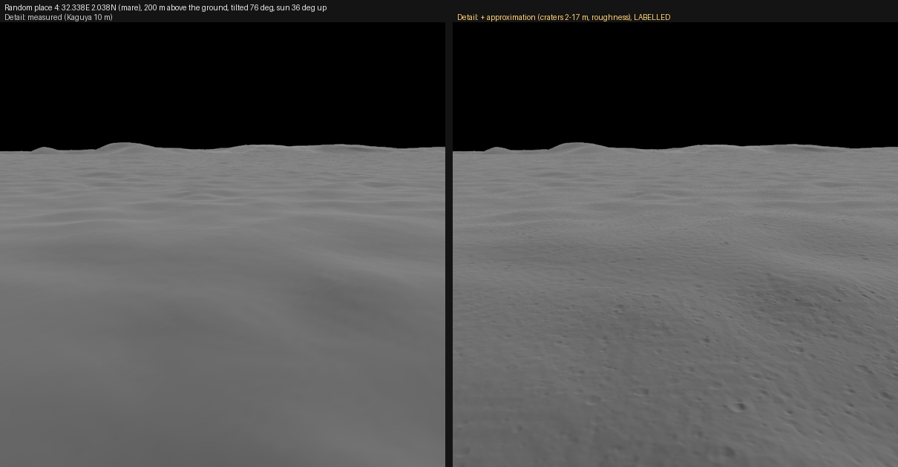
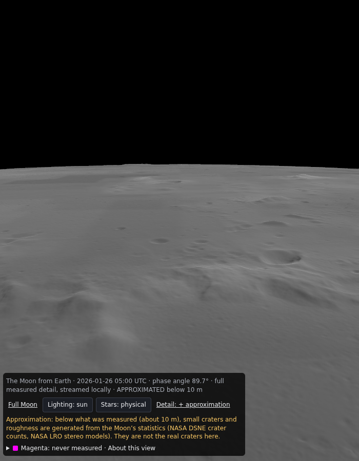

# SS-10b · Approximated detail below the measurements (optional, labelled)

Status: **in review** · Release 3 · 2026-09-25

As a learner zooming past what any mission measured, I want the ground to keep looking like the Moon rather than smooth polygons. When the app shows me detail that is an approximation and not a measurement, I want to be told.

## Owner decision, 2026-09-25

The owner asked: "can we still use polygons but recreate details as an approximation". Offered the choice, they picked **"Both, real first"**:

- **Real first.** The finest real data came first: Kaguya 10 m heights over Albategnius (SS-10, PR #16).
- **Then this.** An optional approximation mode, off by default, labelled on screen while it is on, and kept out of every check.

Later that day, choosing viewpoint streaming (SS-10c), the owner confirmed it: "lets stream it based on viewpoint so we can scale it to very tiny details … of course we will let user know it's an approximation". They also asked about an image service for fills. That was declined, and the owner has not objected: generated images are pictures with lighting baked in, not heights; they differ on every request and cost money per call. The statistical approximation below gives height detail for free, lit by the real Sun, and the same on every visit.

This is an **exception to "Never invent data"** (CLAUDE.md), approved by the owner on this date. The rule stays for everything else. The exception is written into CLAUDE.md in the same PR, with its limits:

1. Off by default.
2. Labelled on screen for as long as it is on.
3. Never in captures, checks or baselines except one for-eyes view that shows the label.
4. Never alters the measured surface at the measured resolution.

## What it does

When the mode is on and the camera is closer than the finest measured level supports, the terrain keeps refining past it. There are up to 3 extra levels below the finest measured one: 1.3 m vertex spacing below Kaguya's 10 m levels (84° S to 84° N in local mode, SS-10c), and correspondingly coarser wherever the finest measurement is coarser. The extra levels are polygons, generated in the browser from the measured parent tile plus two kinds of detail.

- **Roughness.** Fractal height variation whose statistics are **measured from our own data**. The pipeline computes the Kaguya tile's height-difference structure function, RMS Δh against baseline from 8 m to 2 km. Fitting it gives a Hurst exponent and an amplitude, and the extrapolation below 8 m uses that fit. The values go into a committed JSON with the fit's error, and are cross-checked against LOLA's published roughness (Rosenburg et al. 2011; the value is checked against the paper before it is used).
- **Small craters.** Bowls with raised rims, drawn from a published size-frequency distribution for small lunar craters (the empirical equilibrium distribution) and published depth-to-diameter ratios for small craters. Each number is quoted from its source in the JSON, checked against the paper before code; none comes from memory.

## Constraints that keep it honest

- **Band-limited.** Generated detail only has wavelengths shorter than the measured vertex spacing. Averaged over one measured cell it is zero, so the measured surface is unchanged at the scale it was measured. A unit test enforces this.
- **Deterministic and seamless.** Detail is a function of the body-fixed position, not of the tile. The same place always looks the same, and neighbouring tiles agree exactly along their edges (unit test).
- **Labelled.** A switch, "Detail: measured / + approximation". While it is on, a warning reads: "Approximation: small craters and roughness below what was measured are generated from the Moon's statistics. They are not the real craters here." `?detail=approx` in the URL turns it on for sharing, with the same label.
- **Separate.** Generated tiles are never written to disk or served. They exist only in the browser while the mode is on.

## How

- **Plugin:** a 3d-tiles-renderer plugin extends the layer's availability below the measured levels. It answers fetches for those tiles by decoding the measured ancestor tile, subdividing it, adding the detail, and encoding a quantized-mesh tile with normals.
- **Code split:** a TypeScript port of the pipeline's encoder does the encoding. The pure maths goes in `src/core/` (detail spectrum, crater field, band-limit), unit-tested, with no three.js.
- **Frame loop:** stays allocation-free. Generation happens in the tile loader, not per frame.

## As built (2026-09-25)

Three things changed from the plan above. Each is noted here rather than rewritten above.

**1. The measurements set the roughness, and it is small.** `npm run pipeline:roughness` measures the RMS height difference against distance in NASA's LROC NAC stereo terrain models (2 m spacing). It used Apollo 11 (mare) and Apollo 16 (highland), both MD5-verified against their PDS4 labels.
- **Same shape at both sites:** once scaled by their 64 m value, the sites agree within 14% at every distance.
- **Anchored locally:** the model is scaled at each place by Kaguya's own roughness over 67 m.
- **Calibrated on real ground** (Kaguya at Albategnius): it lands within 4% of its target at 1.3, 2.6 and 5.2 m.
- **The finding:** interpolating Kaguya already supplies 91–95% of that target, so the faithful roughness is only about 0.1 m. Stereo matching smooths every height model. So the fine bumps are largely absent from all of them, and roughness statistics alone add almost nothing visible.

**2. So the owner chose craters from published counts** ("Craters from counts"). The source is NASA's *Design Specification for Natural Environments*, SLS-SPEC-159 Revision I (2021), section 3.4.1 (NTRS 20210024522), read for this and quoted in `src/core/approximation.ts`.
- **Density:** the Trask equilibrium function, N(≥D) = 0.079433 D⁻² per km² (D in km; 794 craters of 10 m or more per km², the table's own value). The DSNE calls it valid on every part of the Moon except very young surfaces, and appropriate to extend below 10 m.
- **Shape:** five classes from freshest to degraded, with their fractions and depth/diameter ratios (Table 3.4.1.2-2). The open-ended entries "0.12–0.2+" and "<0.07" are taken as 0.12–0.20 and 0.02–0.07.
- **Sizes:** 2 m up to 16.8 m, twice Kaguya's sample spacing. Larger craters are Kaguya's to measure.
- **Profile:** parabolic bowls. Their rim slopes (22° at d/D 0.1, 39° at 0.2) fall within the DSNE's maximum wall slopes for those classes.
- **No raised rims:** no verified number was found for them.
- **Coverage check:** the fraction of ground inside a crater is 23.3%, matching the analytic value for the law.
- **Not modelled:** the DSNE notes that slopes retain fewer craters; it gives no number for this.

**3. Generated in the local server, not in the browser.** `npm run local` already makes every tile, and only it has 10 m data to approximate below.
- **Separate layer:** levels 14–16 (5.2, 2.6 and 1.3 m vertex spacing) wherever Kaguya measured, as the layer `terrain-approx/`, cached apart in `.cache/local/tiles-approx/`.
- **Never published:** the tiles are never committed or deployed.
- **Speed:** about 1 s per tile on the cloud machine.

**The honesty constraint, made exact.** Both kinds of detail are value noise or craters minus their own bilinear interpolation from Kaguya's sample lattice. So the approximated surface passes exactly through every Kaguya measurement (unit test: under 10⁻⁶ m at random samples). The approximation is only added where Kaguya is the height source.

**Labelled.**
- **Switch:** "Detail: measured / + approximation" appears only in local mode, and the URL is `?detail=approx`.
- **While on:** the caption ends "APPROXIMATED below 10 m", and an amber note explains what is generated and from what.
- **Checks:** a checked capture with the mode on is refused.

## Checks

- **Unit tests:**
  - Band-limit: the mean over each measured cell is within 1 cm of zero.
  - Edge continuity.
  - Determinism.
  - The structure function of generated terrain matches the fitted one within its error.
- **Captures:** every existing capture runs with the mode off and must be unchanged. The harness refuses a check viewpoint with the mode on.
- **For eyes:** one capture, `moon-albategnius-approx`, with the mode on and its label visible.
- **Allocation:** `npm run alloc` with the mode on.

## Not verified by this story

- That generated craters resemble the real ones at any particular spot. They cannot, and the label says so.
- iPhone frame rate with the extra levels.

## Estimate

1 to 2 sessions.
