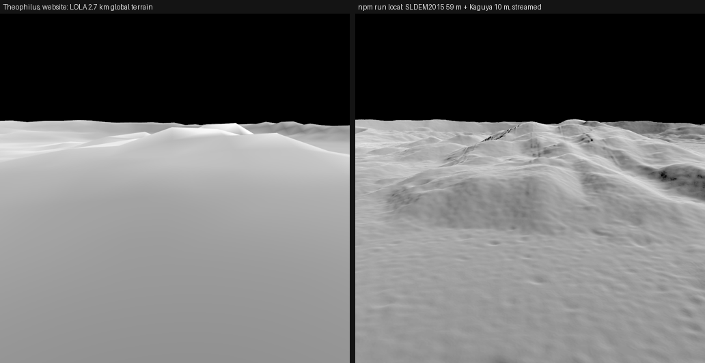

# SS-10c · The whole Moon at full measured detail, streamed locally

Status: **in review** · Release 3 · 2026-09-25

As a learner, I want to fly anywhere on the Moon and see it as finely as it has been measured, without anyone paying for hosting.

## Owner decisions, 2026-09-25

- **"I want a recreation of reality, i.e. we fetch the best sources and recreate this."** Blurry terrain everywhere except around Albategnius was not the goal.
- **"I don't want to pay for storage."** The owner chose **"Hybrid"**:
  - The website stays as it is, free and working on the iPhone.
  - A local mode serves the whole Moon at full measured detail on the owner's computer.
- **"Lets stream it based on viewpoint so we can scale it to very tiny details."** Only what a view needs is fetched, at the detail its distance needs.
- **Below the measurements,** the labelled approximation (SS-10b) comes next.

## What `npm run local` does

1. **Build and serve:** it builds the app and serves it at `http://localhost:5178/`, with the Moon at `/moon/` (SS-13). Localhost is a secure context, so WebGPU runs.
2. **Tiles on demand:** it builds each terrain tile the first time a view asks for it, from the publishers' own files. It fetches only the rows and columns that tile covers, in one multi-range HTTP request per 256 × 256 block (PDS serves `multipart/byteranges`).
3. **Cache:** fetched blocks, downloaded files and built tiles live in `.cache/local/`, so each place is fetched once.

| Levels | Vertex spacing | Source | Coverage |
| --- | --- | --- | --- |
| 0–4 | 85–5.3 km | LOLA LDEM_16 (1.9 km), 66 MB, downloaded whole | global |
| 5–6 | 2.7–1.3 km | LOLA LDEM_64 (474 m), by block | global |
| 7–8 | 670–330 m | LOLA LDEM_128 (237 m), by block | global |
| 9–11 | 170–41 m | SLDEM2015 (LOLA with Kaguya, Barker et al. 2016, 59 m) within 60°; LOLA LDEM_512 (59 m) beyond | global |
| 12–13 | 21–10 m | SELENE (Kaguya) TC DTM_MAP_02 seamless (8.4 m), 233 MB per 3° file, downloaded whole (JAXA's server ignores ranges) | 84° S to 84° N |

- **Missing measurements fall through per vertex:** where a finer product has none at a vertex (outside its coverage, or a no-data sample), the next product's measurement is used for that vertex. Nothing is filled in. Neighbouring tiles evaluate the same function at shared vertices, so their edges agree.
- **Kaguya registration:** every Kaguya file is checked against the LOLA product under it before first use.
  - The check is the mean difference over a 32 × 32 grid of points; the file must be within 5 m, and more than half the points must be measured.
  - Files that fail are not used.
  - Verdicts are kept in `.cache/local/kaguya-registration.json`.
  - Seen so far: Albategnius 0.6 m (SS-10), Tycho 1.1 m, Theophilus 0.5 m and 2.0 m.
- **Size checks:** every range reply is checked against the file size implied by its label (rows × columns × sample size), and every whole download likewise.
- **What cannot be checksummed:** reading parts of a file cannot verify the whole file's checksum, and the publishers post none for these files.
- **Encoder:** `tools/terrain/quantizedMesh.ts`, shared with the website's build: the same format, grid and normals.

## Measured on the cloud machine

- **LOLA/SLDEM tiles:** 0.1–1.5 s each when the blocks are new; about 0.1 s from cache.
- **First Kaguya tile in a 3° square:** about 55 s, for the one-time 233 MB download and the registration check.
- **Theophilus from 2.2 km above its floor:** levels 12 and 13 loaded from two Kaguya files. `moon-theophilus-tilted` is that view; on the website it shows the 2.7 km global terrain.

## Checks

- **Unit tests** (`tools/local/local.test.ts`):
  - File names and URLs match the PDS and JAXA listings.
  - Sample positions match the labels, including the pinned Albategnius byte range and Kaguya corner samples.
  - The level ladder and availability.
  - Multi-range parsing.
  - A tile encode/decode round trip.
  - An unmeasured height is refused rather than invented.
- **Captures:** the website's captures are unchanged. The new for-eyes view renders the website's terrain in CI; CI cannot run local mode, because it downloads gigabytes.

## Not verified

- A long session anywhere other than Tycho, Theophilus and Albategnius.
- Frame rate on real hardware.
- Behaviour when PDS or DARTS is slow or down: a tile then fails with a 502 and the library shows the coarser tile.
- The poles beyond 84°: LDEM_512 is in simple cylindrical projection, so it is heavily stretched there. LOLA's polar stereographic products are the better source; they are in the inventory as "to evaluate".
- Sharpness: Kaguya's heights are smoothed by the stereo processing, so their true resolution is coarser than their 8.4 m spacing. Truly tiny detail is measured only at NASA's 1–5 m stereo sites (next), with the labelled approximation below that (SS-10b).
