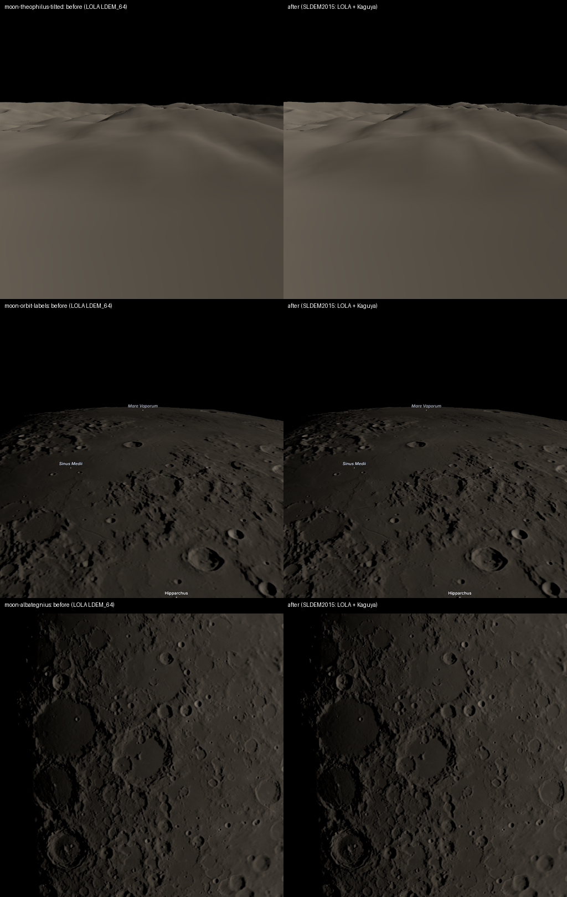

# SS-10d · The website's relief, measured everywhere within 60°

Status: **built** · 2026-09-29

As a learner, I want the website's relief everywhere to be measured, not interpolated between laser tracks.

## Owner decisions, 2026-09-29

- "Lets use the kaguya information before we move on to Mars".
- Of the choices offered, **"Rebuild global relief (Recommended)"**: the website's terrain levels 0–7 from SLDEM2015 within 60°, blended into LOLA poleward, within the same size budget.
- Kaguya's Multiband Imager is recorded in the inventory but not downloaded. At the website's 1.3 km per texel, the WAC mosaic (400 m, SS-5b) already exceeds what the texture shows. MI's 20 m would matter only for close-up local mode.

## Why

- **Before:** the website's global relief (levels 0–7) came from LOLA `LDEM_64` (474 m).
- **The gaps:** near the equator, LOLA's laser tracks are several kilometres apart, so `LDEM_64` interpolates between them there.
- **SLDEM2015 fills them:** Barker et al. 2016 co-registered LOLA with Kaguya Terrain Camera stereo, which measured between the tracks.
- **Until now:** it was used only in local mode, at levels 9–11 (SS-10c).

## The data

**SLDEM2015** global float product, `sldem2015_128_60s_60n_000_360_float.img` (PDS). From its label:
- **Grid:** 128 pixels per degree, 60°S to 60°N, 0–360°E. That is 15,360 lines by 46,080 samples, 2.83 GB.
- **Values:** IEEE 754 little-endian floats in km, relative to the 1737.4 km sphere (`OFFSET`).
- **Pixel registration:** pixel-registered, so centres sit at half-pixel offsets.
- **Coordinates:**
  - Planetocentric latitude, east-positive longitude.
  - Frame: MEAN EARTH/POLAR AXIS OF DE421, the same frame as LOLA.
- **Pinned:** SHA-256 `d937ff8f…0e06` (`tools/terrain/build.ts`). Cached in CI with the other terrain sources.

## What was built

- **Resampling** (`tools/terrain/build.ts`, `sldem64()`):
  - Read two lines at a time and average each 2×2 block to 64 px/deg.
  - That is exactly LDEM_64's pixel-registered grid, so each output pixel covers the same area as the one it replaces.
  - Every value is the mean of four measured ones.
- **Blend** (`LatitudeBlend`, `tools/terrain/sources.ts`, tested):
  - SLDEM2015 equatorward of 58°.
  - LDEM_64 poleward of 60°, where SLDEM2015 ends.
  - A smoothstep between the two.
  - Where SLDEM2015 has no value, LDEM_64 is used.
- **Agreement check:** before any tile is written, SLDEM2015 is compared with LDEM_64 over the band.
  - Result: 171,048,960 samples, mean difference −0.16 m, RMS 23.72 m, correlation 0.999948.
  - The RMS is the relief Kaguya adds between laser tracks.
  - The build refuses if the mean differs by more than 5 m, which would mean a datum or frame mismatch.
  - The result is recorded in the built `sources.json`, with each source's checksum and the blend band.
- **Other levels are unchanged:**
  - LDEM_512 around Albategnius and Kaguya's DTM at levels 12–13, over Albategnius's floor and peak.
  - LDEM_64 poleward of 60°.
- **Size:** 46,743 tiles, 677 MB gzip-compressed, within the 900 MB budget.
- **Attribution:** the on-screen terrain attribution names SLDEM2015.

## Checks

- **Unit tests:** `tools/terrain/sources.test.ts` covers the blend's weights and endpoints and the fallback where SLDEM2015 has no value.
- **Captures:**
  - Every photometry and Gazetteer check passes.
  - The negative controls fail, as they must.
  - Three views changed past tolerance and are re-accepted in their own commit: `moon-albategnius`, `moon-theophilus-tilted` and `moon-orbit-labels`.
  - `moon-orbit` and `moon-earthrise` moved within tolerance.
  - The Albategnius close-ups (`-60km`, `-tilted`, `-peak`) are unchanged: finer levels from LDEM_512 and Kaguya's DTM draw them.

## What changes on screen

- **At orbit:** crater rims and small craters between the laser tracks are crisper.
- **Low over Theophilus:** the hills have their measured shape instead of the smooth interpolation between tracks.

## Not verified

- **On the owner's iPhone:** how it looks, and frame rate. The tile count and sizes are similar to before.
- **Poleward of 60°:** still LDEM_64. The LOLA polar DEMs (5–20 m) remain on the inventory's "to evaluate" list for elevation.
- **Kaguya MI:** not used.
- **Local mode:** unchanged, and not re-run.

## Effort

One session, 2026-09-29.
