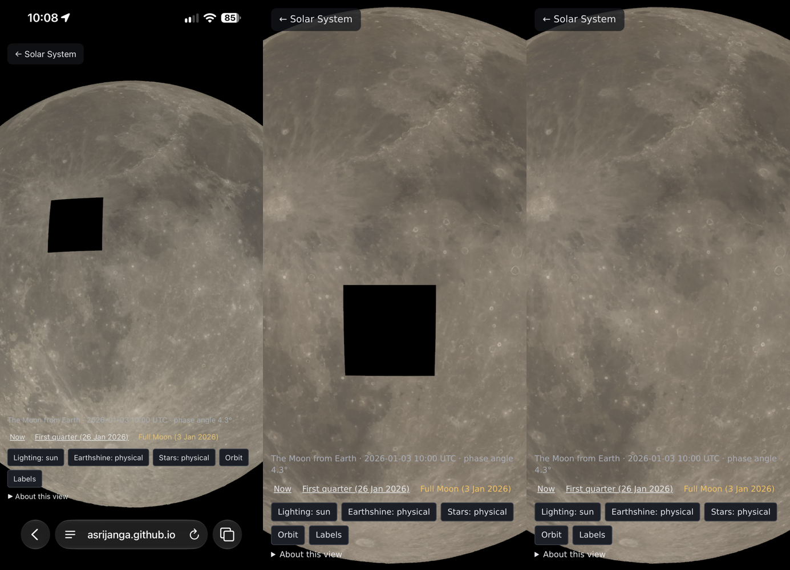

# SS-10e · No holes in the Moon

Status: **built** · 2026-10-02

As a learner, I want the Moon whole every time, so that a dropped download never leaves a hole in it.

## What the owner saw

- **When:** 2026-10-01 and 2026-10-02, on an iPad and an iPhone.
- **What:** a black square on the full Moon, north-west of the centre near Copernicus (`ss10e-hole.png`, left). It stayed until reload.
- **Why it was not Safari's cache:** a fresh `?v=` did not clear it on the first report.

## Cause

- **The tiles are sound.** Their size and position match one terrain tile, 11.25° across (level 4). That tile and its neighbours, fetched from the live site, decode with every height in range (−3153 to +673 m for 4/14/9) and every index valid.
- **Not reproduced by default.** In headless Chromium at iPhone size and zoom, 868 tile requests all succeeded and no hole appeared.
- **What the library does with a failed tile.** 3d-tiles-renderer 0.5.3 counts a tile that failed to load as finished (`isDownloadFinished`: `LOADED || FAILED`). So it hides the coarser parent and draws nothing in the child's place, and it never asks for the tile again.
- **What the app did.** Its tile fetch made one attempt. A single dropped connection on a phone was therefore a permanent hole.
- **Reproduced:** blocking one tile's download (4/15/7) in headless Chromium leaves exactly that black square (`ss10e-hole.png`, middle). The page asked for the tile once.

## Fix

In `src/scenes/tileFetch.ts`:
- **Retries in the fetch.** Each tile gets up to 4 attempts, waiting 0.5, 1 and 2 s between them.
  - Retried: a dropped connection, a server error (5xx or 429), and a transfer cut short. The tile is inflated inside the attempt, so a truncated gzip stream counts as a failure.
  - Not retried: a missing tile (404), and a request the renderer itself aborted.
- **A later retry.** If a tile still fails, the renderer is asked 5 s later to load every failed tile again, at most 20 times per page.
  - The library's own `resetFailedTiles()` could not do this. It throws on tiles it has not set up yet ("Cannot read properties of undefined (reading 'loadingState')"). It also leaves the failed tile in its cache, which then refuses a new download.
  - So the app removes failed tiles from the cache itself, which runs the cache's own unload and marks them unloaded.

## Checks

- **Unit tests** (`src/scenes/tileFetch.test.ts`, 6 new):
  - A dropped connection is retried and the tile inflated.
  - A server error is retried.
  - A transfer cut short is retried.
  - A 404 is not retried.
  - It gives up after 4 attempts.
  - An aborted request is never retried.
- **Browser runs** (headless Chromium at 390 × 844, device pixel ratio 3, `?epoch=full&at=-5,0,1800`), one tile made to fail:
  - **Failing twice:** loaded on the third request, no hole.
  - **Failing six times:** the fetch gave up after 4, the later retry loaded it on the seventh request, no hole (`ss10e-hole.png`, right).
  - **Failing always:** retried in bounded rounds (35 requests in 90 s), a hole only for as long as the tile truly cannot load.
- **Full suite:** `npm run check` passes all 191 tests. The captures are unchanged.

## Not verified

- **On the owner's devices.** Whether the original failure was a dropped connection, as reproduced here, or something particular to Safari that a retry also covers.
  - If a hole ever lasts beyond a few seconds now, a screenshot will say which.
- **On real hardware.** How many tiles fail on a phone network. The cloud's network does not drop tiles.
