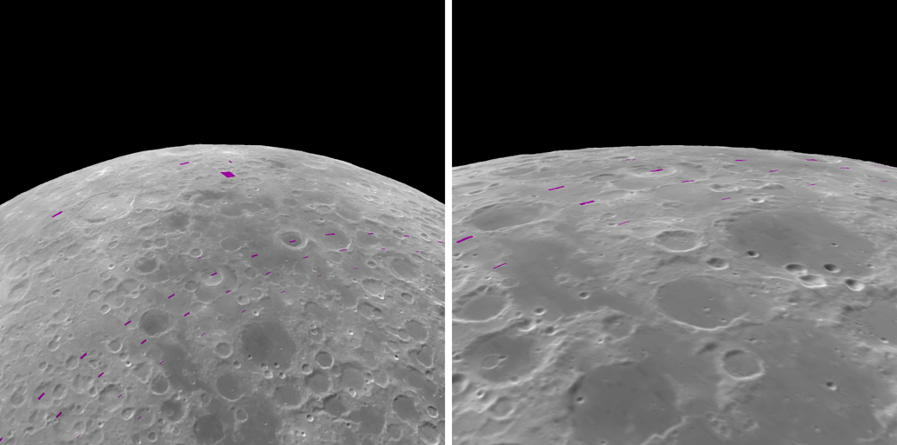
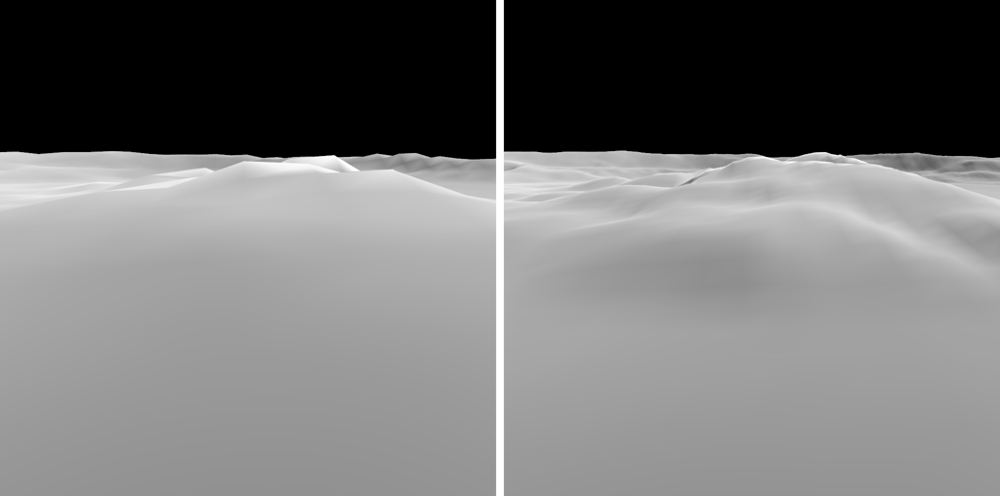

# SS-11b · Orbit mode: a real orbit, flown for you

Status: **in review** · Release 3 · 2026-09-25

As a learner, I want to sit back and orbit the Moon, low enough to see its terrain but never so low that it turns blurry, without steering it with my fingers.

## Owner decision, 2026-09-25

The owner said: "I am not going to host it anywhere else, github pages is fine. We will have to work around it … can i enter an orbit mode where you randomly select the altitude and direction and put me in orbit in a cinematic mode with objects in the background coming and going. It should be close enough where i can see terrain but at a distance where I should not see blurry terrain."

That gives three things to deliver:

1. **Orbit mode,** in this story.
2. **Sharper terrain that fits on GitHub Pages,** so the orbit can come lower. This is part 2 below, in its own PR.
3. **"Objects in the background coming and going".** Nothing but the Moon and stars is rendered yet. Earth needs its own data story, with its own inventory and sources. Stars are drawn at their true brightness next to a sunlit Moon, which is almost invisible, as it is to a real eye or camera. Neither is faked here.

## What it does

- **An "Orbit" button.** It puts the camera in a random circular orbit around the Moon. The gestures step aside while it flies, and pressing it again hands control back. `?orbit` in the URL starts a random orbit, and `?orbit=<seed>` repeats a given one, so a view can be shared.
- **A real orbit.** The speed is the circular orbital speed √(GM/r), using the Moon's GM from the same SPICE kernel set as the ephemeris: `gm_de440.tpc`, BODY301_GM = 4902.800118457549 km³/s², SHA-256 pinned in `pipeline/ephemeris.py`. At real speed, 1.3 to 1.5 km/s, one orbit takes about two to three hours. A "Time" button runs it ×10 or ×100, and a note says so whenever it is not real speed.
- **Random but always worth seeing:**
  - **Plane:** the orbit plane's normal is uniform on the sphere, so any inclination and direction.
  - **Height:** from the lowest sharp height (below) up to 1.5 times it.
  - **Start:** over ground where the Sun is 8° to 35° above the horizon, so the relief casts its shading. The flight then carries on round, through the terminator and over the night side, as a real orbit does.
- **Framing:** the camera looks ahead along the track, tilted down so the horizon sits 35% of the half-height above the centre of the view. The curved limb shows against black space.

## Never blurry: how low it goes

The height is chosen so that nothing on screen is magnified past its data.

- **Nearest ground:** the ground nearest the camera is at the bottom edge of the frame. The height is found by bisection so that a measured sample there spans at most 3 device pixels.
- **The sample:** the finest terrain level the site has everywhere on the Moon, or half the albedo map's texel, whichever is coarser. Brightness varies more gently than shape, so it may take twice the size on screen.
- **Depends on the screen:** a taller screen in device pixels needs more distance for the same sharpness.
- **Code:** `sharpHeightKm` in `src/core/orbit.ts`, unit-tested.

| Terrain everywhere | Sample | Capture (1024 px) | Laptop (1600 px) | iPhone (2532 px) |
| --- | --- | --- | --- | --- |
| Level 5, today's website | 2.67 km | 1037 km | 1624 km | 2481 km |
| Level 6 | 1.33 km | 492 km | 800 km | 1289 km |
| Level 7, part 2 | 0.67 km | 226 km | 374 km | 621 km |

Heights are from the 1737.4 km sphere, with a 50° vertical field of view and at most 3 px per sample.

## Part 2: sharper terrain within GitHub Pages (its own PR)

GitHub Pages publishes at most about 1 GB, counted uncompressed. Until this part, the website's terrain stopped at level 5 (2.7 km) everywhere, adding finer levels only around Albategnius.

- **Compressed tiles.** Pages already sends `.terrain` files gzip-encoded in transit, but counts their full size against the limit.
  - **Build:** `tools/terrain/build.ts` writes each tile gzip-compressed at level 9.
  - **Browser:** a terrain plugin in `src/scenes/moon.ts` recognises the gzip header (1f 8b) and inflates the tile with the browser's own `DecompressionStream`. Anything else passes straight through, including `layer.json` and local mode's uncompressed tiles.
- **Global levels 6 and 7** (1.33 km and 0.67 km vertex spacing), from the same LOLA LDEM_64 (474 m) as levels 0–5. The level-7 box around Albategnius is no longer needed.
- **Budget.** The build fails if the terrain passes 900 MB, which leaves room for the rest of the site.
- **Build time.** CI caches the built tiles, keyed on the build code and the pinned sources, so the build only runs when one of them changes.

### As built (2026-09-26)

| Level | Tiles | Size |
| --- | --- | --- |
| 5 | 2,048 | 30 MB |
| 6 | 8,192 | 119 MB |
| 7 | 32,768 | 468 MB |
| All, 0–13 | 46,743 | 671 MB |

- **Build time:** 8 minutes on the cloud machine.
- **Site size:** the whole site is 724 MB on disk.
- **Before:** 485 MB uncompressed, for levels 0–5 plus the Albategnius boxes.

**Three views change,** as expected: every one gains finer measured relief where it used to show the 2.7 km grid.
- **`moon-orbit`:** comes down from about 1040 km to about 230 km, which is the point of this part.
- **`moon-theophilus-tilted`:** Theophilus's walls and central peaks now show at 0.67 km.
- **`moon-albategnius`:** its surroundings outside the high-resolution box sharpen.

**The allocation gate outgrew one profile.** On CI, with 0.67 km terrain everywhere, `npm run alloc -- orbit=7` crashed after its 600 measured frames. Chrome's heap profile came back larger than the longest string Node can parse (512 MB, `ERR_STRING_TOO_LONG`). Orbit mode streams terrain to the horizon, and three.js allocates heavily while it loads.
- **Fix:** the gate now samples in chunks of 50 frames, one profile each, and adds the chunks up (`mergeAttributions`, unit-tested to match one profile of the same samples).
- **Unchanged:** the rule (0 B sampled in `src/`), the sampling interval and the 600 frames.
- **Not counted:** a frame that began before its chunk's sampling started, and the few frames between chunks. The report gives how many.

**Orbit mode is measured without terrain.** With 0.67 km terrain to the horizon, SwiftShader drew orbit mode so slowly that 600 frames did not fit in 30 minutes, even chunked; the run took 44 minutes before timing out.
- **The switch:** `?relief=off` draws the smooth sphere instead, and CI's second run is now `npm run alloc -- orbit=7 relief=off`. It measures exactly the orbit's own frame code: the flight, and the loop around it.
- **Where terrain is still covered:** the first run, with terrain streaming, which is unchanged.
- **Not measured:** allocation from terrain streaming *during orbit*. It is three.js and 3d-tiles-renderer code, not `src/`, and the first run exercises the same code.
- **Captures:** none use the switch.

## Owner feedback, 2026-09-26: gestures first, then orbit

"Wait i can't zoom out anymore, i need the gesture to zoom in and zoom out and then start orbit."

- **Start:** the Orbit button now starts from the view the gestures left.
  - It starts over the point below the camera, at the camera's height.
  - It never goes below the lowest sharp height; the note says so when it is at that floor.
  - The heading is still random. The Sun-elevation rule no longer applies, because the owner chose the place.
- **In flight:** pinch or scroll raises and lowers the orbit, between the lowest sharp height and the controls' farthest distance (60 Moon radii).
  - The speed follows the height, since a real circular orbit is slower higher up.
  - The note reports the new height and speed.
- **Unchanged:** `?orbit` and `?orbit=<seed>` still fly the random orbit, which is what the `moon-orbit` capture shows.
- **Gestures outside orbit:** they work as before. Zooming both ways was checked before and after an orbit, in headless Chromium.
- **Flight test:** a new test changes height in flight. The camera must stay over the same point along the track, move to the new height, and continue at that height's circular speed.

## Checks

- **Unit tests** (`src/core/orbit.test.ts`):
  - Circular speed at 100 km and 1000 km against the textbook values (1.6335 and 1.3383 km/s).
  - Horizon dip.
  - Ray-to-ground distance.
  - The sharp height meets its pixel limit exactly.
  - A seed always gives the same orbit.
  - Every random orbit starts with the Sun 8° to 35° up, between 1 and 1.5 times the minimum height, on a unit orthogonal plane basis at circular speed.
- **Capture:** `moon-orbit`, seed 7 at first quarter, the start of a random orbit. It is a new baseline, and every existing capture is unchanged.
- **Flight tests** (`src/scenes/orbitFlight.test.ts`):
  - For three seeds, the camera is where the orbit maths puts it at the start, 100 s later, and after switching to ×100 with no jump.
  - The view's centre is exactly `viewDepression` below the local horizontal, heading along the track, with no roll.
  - Reversing the direction of travel, or the heading, fails them.
- **Allocation:** CI runs `npm run alloc` a second time with `?orbit=7`.
  - Orbit mode draws terrain to the horizon, so SwiftShader renders it more slowly: 600 frames took 524 s locally, and on CI the 600 warm-up frames overran the script's 900 s wait.
  - Its wait limit is now 30 minutes for every run. That is a wait, not a pass criterion: the rule is still 0 B sampled in `src/`.

## As built (2026-09-26)

**The frame path took four tries to make allocation-free.** Each was measured with `npm run alloc -- orbit=7`.

1. **146 B, then 74 B per frame:** computing the pose in typed arrays and passing numbers to three's vector setters.
2. **24 B per frame:** doing every sum with three's vector and quaternion methods instead.
3. **24 B again,** after fixing a separate bug. three's animation loop makes its first call with no timestamp, and that would have made the orbit's angle NaN in the live app. `frame` now ignores such a call, and a test covers it. The capture renders only the starting pose, so it could not show this.
4. **0 B:** the final version.
   - It does its arithmetic in one typed array.
   - It hands three the camera's whole matrix in a single `fromArray` call, with `matrixAutoUpdate` off while flying. `release` restores position, quaternion and up for the gestures.

**How the cause was narrowed down:**
- **V8's trace:** with `--trace-opt --trace-deopt`, V8 optimised the flight with Maglev and never deoptimised it, so this was not unoptimised code.
- **Not in isolation:** a browser harness running the same class with real timestamps, at the check's frame counts, allocated nothing.
- **What that leaves:** the allocation came from writing fractional numbers into three's `Vector3` and `Quaternion` fields from our function, inside the full app. A matrix's elements are a plain array of doubles.
- **Unconfirmed:** why those field writes allocate only in the full app.

## Not verified by this story

- How it looks and runs on the owner's iPhone.
- The frame rate while terrain streams in behind a moving camera. The cloud has no GPU.
- Whether tiles stream in fast enough at ×100 time, over a phone connection.
