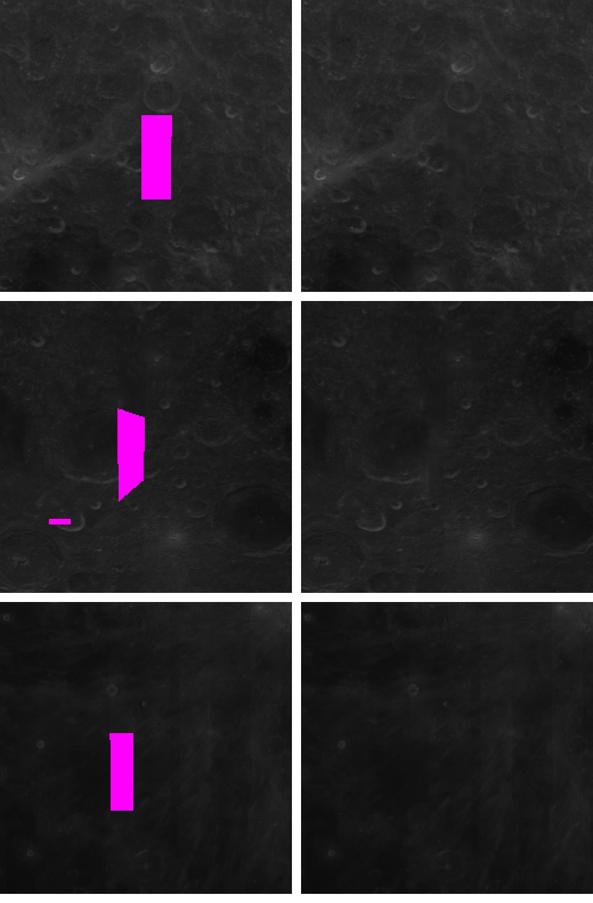
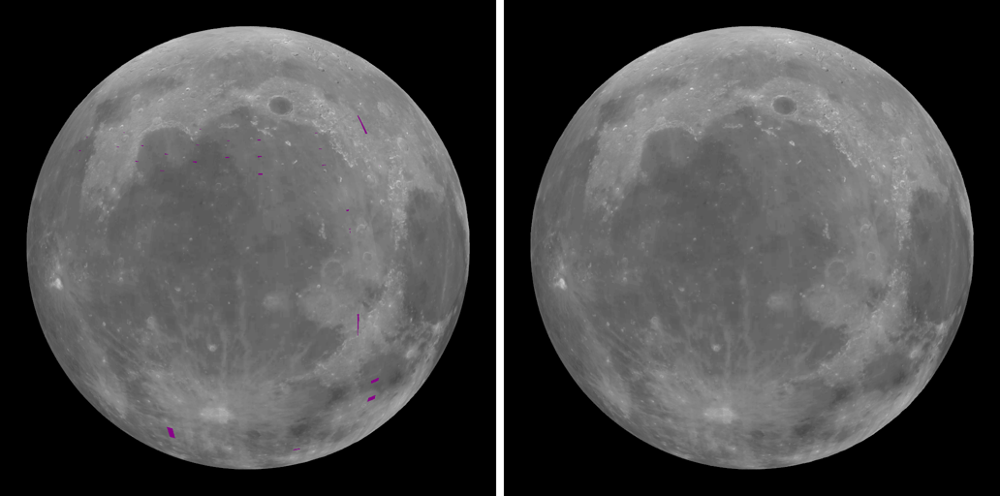

# SS-11c · No magenta: Clementine's last gaps filled from LOLA

Status: **in review** · Release 3 · 2026-09-26

As a learner flying in orbit, I want the whole surface to look like the Moon, with no marks that break the view.

## Owner decision, 2026-09-26

"This purple is distracting and disrupting the cinematic effect, drop purple and fill gaps."

Until now, the places Clementine never imaged were shaded with the disc-mean albedo and coloured magenta, so they could never pass for data (SS-6). Since SS-6b, LOLA's polar laser albedo has already filled the polar gaps. What remained were 19,917 texels, 0.06% of the map, in small strips at low latitudes.

- **The fill is a measurement, not an invention** (CLAUDE.md, "Never invent data" and "Combine every available source").
- **Source:** LOLA's global laser albedo map, `LDAM_10_FLOAT` (Lemelin et al. 2016). It comes from the same PDS data set as the polar maps already in use.
- **Why it covers the gaps:** the laser lights the surface itself, so it measured everywhere the camera missed.

## Source and conventions

From `ldam_10_float.lbl`, PDS `LRO-L-LOLA-4-GDR-V1.0`:
- **Grid:** 3600 × 1800 32-bit little-endian floats, simple cylindrical, 10 pixels per degree (3032 m per pixel at the equator), sphere R = 1737.4 km.
- **Registration:** pixel registered. `CENTER_LONGITUDE` 180, `LINE_PROJECTION_OFFSET` 899.5, `SAMPLE_PROJECTION_OFFSET` 1799.5. The first pixel is centred at 89.95° N, 0.05° E.
- **Frame:** planetocentric latitude, `POSITIVE_LONGITUDE_DIRECTION` EAST, frame `MEAN EARTH/POLAR AXIS OF DE421`.
- **Values:** 1064 nm normal albedo, 0.130 to 0.573.
- **Interpolation:** the label says the ground tracks were interpolated with Generic Mapping Tools; that is the publisher's product.
- **Checksum:** LOLA publishes none. The SHA-256 was pinned from the first download, which matched the label exactly: 25,920,000 bytes, and the label's minimum and maximum to every printed digit.

This is not the "LOLA 1064 nm albedo, 10 ppd (USGS mosaic)" rejected in SS-6. That was a mosaic of individual laser tracks with stripes and gaps, correlating with Clementine at about 0. `LDAM_10` is the LOLA team's gridded map, with complete coverage.

## How (`pipeline/lola_global.py`)

1. **Calibration.** Clementine value = gain · LOLA albedo + offset, least squares, over |latitude| < 60° where Clementine imaged the surface.
   - **Result:** 22.3 million texels, gain 207.87, offset −19.81, r = 0.923, RMS residual 4.6 grey levels.
   - **Registration check:** a registration error in either axis would collapse the correlation, so r = 0.92 confirms the conventions above.
2. **Local match.** The two maps differ in wavelength (750 and 1064 nm) and resolution.
   - The difference, Clementine minus calibrated LOLA, is known wherever Clementine measured.
   - Inside each gap it is carried in from the surroundings by the pull-push spreading the encoder already uses, and added to the calibrated LOLA value.
   - **Effect:** each fill meets Clementine at its edges, and the detail inside is LOLA's.
   - **Size of the correction:** median 2.0 grey levels, 99th percentile 13.2.
3. **Only the gaps.** Every Clementine and polar LOLA texel is unchanged.
4. **No mask.** With no unmeasured texel left, `albedo-mask.png` is no longer written.
   - The manifest says `"mask": null`.
   - The app skips the gap texture and its shader branch; before, that was a 4 MB texture on the GPU.
   - The magenta key and its note appear only if a mask ever returns.

The filled strips are softer than their surroundings, since LOLA's map is 3 km per pixel. That is the finest measurement there.

## A check that changed with the decision

`pipeline/test_moon.py` had `test_gaps_are_kept_and_rare`, which required Clementine's gaps to survive as missing. That encoded the old rule for gaps, which the owner has now replaced. It becomes `test_every_pixel_is_measured`, which is stricter in the new direction:
- There is no mask.
- `missingPixels` is 0.
- The pixels Clementine lacked equal exactly those filled at the poles plus those filled from `LDAM_10`.

The new `pipeline/test_lola_global.py` checks the label's registration and the sampling.

## Checks

- **Pipeline:** `npm run pipeline:moon` and `pipeline:calibrate` were re-run.
  - The albedo scale moves from 7.92102 to 7.92177 (0.01%).
  - The WebP is still quality 85, 1.40 MB.
  - `npm run pipeline:test`: 49 tests pass.
- **Captures:**
  - `moon-orbit` and `moon-limb` change past tolerance: their magenta goes, 803 and 842 pixels, and nothing else changes.
  - Every other view changes less than the tolerance, or not at all.

## Not verified

- How the filled strips look up close on real hardware.
