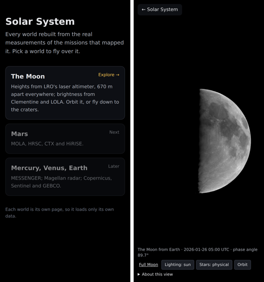

# SS-13 · One page per world, and a page to pick one

Status: **in review** · Release 4 · 2026-09-26

As a learner, I want to choose a world from a home page and have each world on a page of its own with a way back, so that every world can grow as detailed as its data allows without slowing the others.

## Owner decision, 2026-09-26

"We have to divide our pages per object in solar system, since we plan to work on individual objects and each object will have massive details. One page to have the navigation to select pages and each object has a button to go back."

The README's SS-13, a true-scale map showing real distances, stays the goal for the home page. This story builds the structure it will sit in:
- a plain home page that picks a world;
- one page per world, each loading only its own code and data.

## What it does

- **`/` is the home page.** It lists the worlds.
  - The Moon links to its page.
  - The next worlds from the catalogue are shown as not built yet: Mars, then Mercury, Venus and Earth.
  - It is plain HTML with no three.js, so it loads instantly on a phone.
- **`/moon/` is the Moon.** It has an "← Solar System" link in its top-left corner, in interactive use only, so captures still show the world alone.
- **Old links still work.** Any address with a query, such as `?orbit` or `?at=…`, was always the Moon, so the home page forwards it to `moon/` with the query intact.
- **Shared data stays at the site root.** Stars, terrain tiles and each world's data folder are resolved with `siteUrl()` (`src/site.ts`) as `../` from the world's page. That holds in development, on GitHub Pages under `/solar-system/`, in local mode and in captures.
- **Local mode** (`npm run local`) serves each directory's `index.html`, so the Moon is at `http://localhost:5178/moon/`.

## Why a page per world

- **Code:** each page is its own Vite entry, so a world's code and data load only on its page.
- **Storage:** GitHub Pages allows about 1 GB per site, counted uncompressed. The Moon alone uses 671 MB of terrain.
  - Pages per world do not change that: every page shares the one site.
  - What scales is **one data repository per world**: each repository gets its own Pages site and its own 1 GB, and Pages sends `access-control-allow-origin: *`, so a world's page can load tiles from its own data site.
  - That is a later story for the first world that needs it. It needs the owner to create the repository.

## Checks

- **`npm run check`:** 138 tests, build, and bundle size. The home page adds no JavaScript bundle; its one inline script is the redirect.
- **Captures:** every canonical view, now loaded from `moon/`, matches its baseline unchanged. This proves the Moon's data and terrain still load through `siteUrl()`.
- **Allocation:** `npm run alloc` now loads `moon/` too.
- **Browser run** at iPhone size (390 × 844 at 2×), in headless Chromium, on the production build:
  1. The home page renders.
  2. `?orbit=7` forwards to `moon/?orbit=7`.
  3. Tapping the Moon opens its page.
  4. "← Solar System" returns home.
  5. No failed requests.
- **Local mode:** `/`, `/moon/`, `/data/moon/albedo.json` and `/terrain/layer.json` all answer 200.

## Not verified

- The home page and the Back link on the owner's iPhone, including the notch area (both use `safe-area-inset`).
