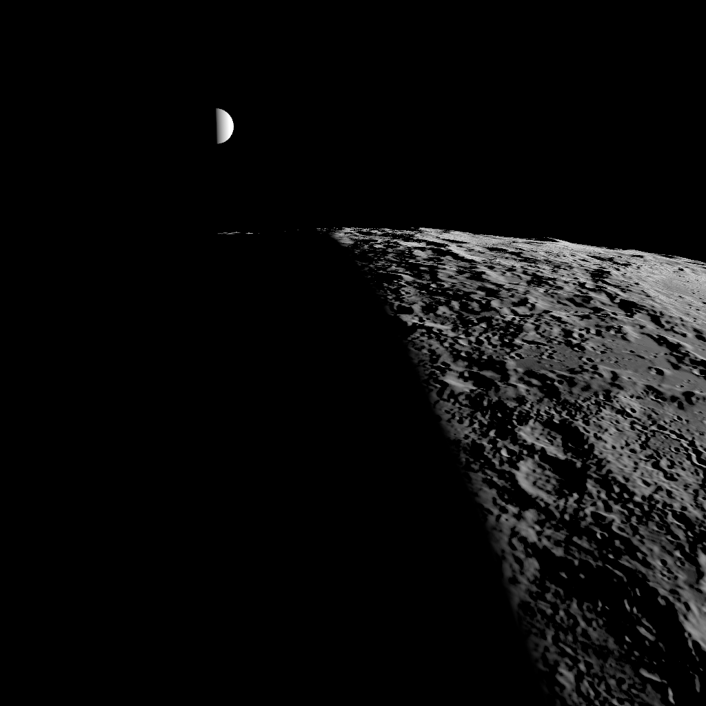

# SS-13b · Earth in the Moon's sky

Status: **in review** · Release 4 · 2026-09-26

As a learner orbiting the Moon, I want to see Earth where it really is, lit by the Sun, rising and setting as I go round.

## Owner decisions, 2026-09-26

- **Orbit mode request:** "objects in the background coming and going".
- **Later that day:** "let's also add the earth in the sky lit with sunlight".

This is story W8 of the world recipe (`docs/world-recipe.md`) for the Moon.

## What it does

- **Where:** Earth sits where the ephemeris puts it at the epoch: `earthDirectionJ2000` and `earthDistanceKm`, from DE440 by SPICE (`pipeline/ephemeris.py`).
- **Size:** its radii come from the same pinned kernel set: `pck00011.tpc` BODY399_RADII, 6378.1366 × 6378.1366 × 6356.7519 km. `pipeline/ephemeris.py` now writes them into `ephemeris.json`, and CI re-derives and diffs the file as before.
- **Lighting:** the same Sun as the Moon, with the same photometry (`core/photometry.ts`): display = exposure · I/F / r², no tone mapping.
- **Brightness:** until Earth's own round of the recipe gives it real surface, ocean and cloud data, it is a uniform Lambert sphere.
  - Its geometric albedo, 0.434, is from the NASA Earth Fact Sheet ("Geometric albedo 0.434").
  - For a Lambert sphere the albedo is A = 3p/2 = 0.651. A unit test checks the disc mean against p.
  - At the Moon's exposure the sunlit Earth is far brighter than the grey Moon and clips to white, as in the Apollo photographs.
- **Honesty:** there is no colour, no cloud and no ocean yet, and the "About this view" text says so.
- **Pole:** Earth's pole is taken as the J2000 z axis. Precession since J2000 is about 0.4°, which only tilts a 0.3% flattening.

On the Orbit button's orbit (SS-15), Earth sets behind the Moon about 123° along it and rises ahead over the south pole about 248° along it. That is the Earthrise the Apollo 8 crew photographed.

## Checks

- **Unit test:** the Lambert albedo reproduces the fact sheet's geometric albedo as the disc mean at zero phase.
- **Captures:**
  - The new `moon-earthrise`: Earth half-lit, as it is at the Moon's first quarter, about 4° above the horizon ahead.
  - No existing capture changes: Earth is behind the camera in every view from Earth's direction.

## Not verified

- How Earth looks on the owner's iPhone.
- Earth's colour, clouds and oceans. They wait for Earth's own data round.
