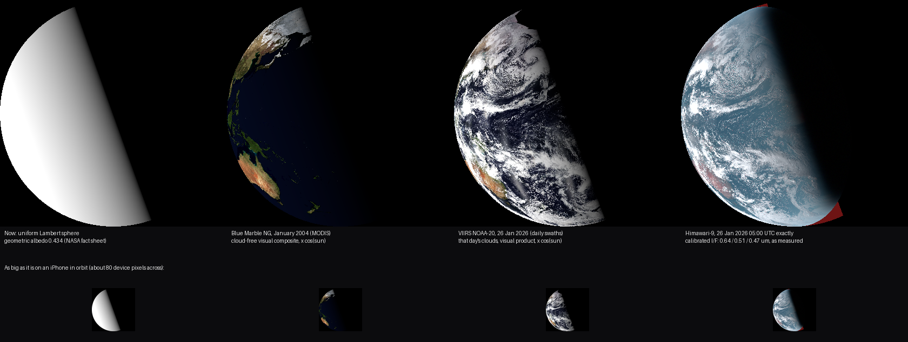

# SS-13c · Earth's real face in the Moon's sky

Status: **proposed, awaiting the owner's approval** · 2026-09-26

As a learner on the Moon, I want Earth to look as it really did at that moment, with its clouds, oceans, continents and blue air, not a plain ball.

## Owner request, 2026-09-26

"The earth in the background is just a ball, we need to emulate real earth details at this distance."

## Why the ball

SS-13b drew Earth as a uniform sphere of the right albedo, lit by the right Sun, until Earth had data of its own (world recipe W8). This story gives it data. The inventory is `docs/data/earth.md`.

## What "this distance" allows

From the Moon, Earth spans 1.9°. In orbit on an iPhone that is about 80 device pixels across, so one pixel is about 150 km of Earth.

So what matters is:
- **Clouds:** where they were at that moment.
- **The surface under them:** ocean, land and ice.
- **The atmosphere:** its blue, and the soft edge it gives the terminator.
- **The terminator** itself.

Relief, rivers and city lights cannot show at this size.

## The products, side by side

Every panel shows Earth as the Moon saw it at the app's first-quarter instant. Each is drawn with the app's own photometry, display = 2 · I/F / r², with no tone mapping (`pipeline/compare_earth_products.py`).

1. **Now:** the uniform sphere.
2. **Blue Marble** (January, cloud-free): an Earth that never exists, since about two-thirds of it is always under cloud.
3. **VIIRS, that day:** the right day's clouds, but each place is imaged at about 13:30 local time, with gaps between orbits. It is a stretched visual product with the atmosphere's blue removed.
4. **Himawari-9 at 05:00 UTC exactly:** calibrated reflectance in three colours. It shows the real clouds at that moment, the atmosphere's blue, and a terminator that softens where the air scatters light.
   - It has data over 98.9% of the lit disc the Moon sees.
   - The dark red is the last 1.1%, beyond Himawari's view.

## Proposal: option 4, measured at the instant

**Source.** The geostationary satellites' own calibrated images at the app's instants (`docs/data/earth.md`):
- Himawari-9 as the primary.
- GOES-18 for Himawari's last 1.1%, cross-calibrated where the two overlap, with the fit recorded.
- For the full-Moon instant's thin crescent, whichever satellite sees it: GOES-19 or EPIC, to evaluate.
- Each place comes from the satellite that sees it most directly, blended across a stated band. Nothing is filled in.

**Colour.** Earth would be the app's first coloured body: red 0.64 µm, green 0.51 µm and blue 0.47 µm, each as measured. The Moon stays as it is.

Himawari's 0.51 µm is bluer than the eye's green, so vegetation looks slightly less green than in a photograph. A published correction that blends in the 0.86 µm band exists. It would be cited in the build, or left out.

**Brightness.** The measured reflectance already includes the Sun's angle, the terminator and the atmosphere. The app shows it as measured: display = exposure · I/F / r², the same rule as for the Moon and the stars, with no ambient light.

**Pipeline.** A new `pipeline:earth` step:
- **Language:** Python, for the bzip2 Himawari files, the NetCDF GOES files and whole-image numpy.
- **Output:** one 2048 × 1024 map per instant (about 20 km per pixel, 8 times finer than the screen needs), stored losslessly, a few MB in all.
- **Sources:** every file is pinned by SHA-256.
- **CI:** the downloads (about 0.6 GB per instant) are too large for it, as with the Moon's source texture. CI instead checks the committed maps, below.

**Orientation.** Earth's rotation at each instant comes from SPICE (`IAU_EARTH`, `pck00011.tpc`). It is written into `ephemeris.json`, which CI already re-derives.

**Honesty.**
- The About text says: "Earth as Himawari-9 and GOES-18 saw it at 05:00 UTC on 26 January 2026".
- The satellites see Earth from a different direction than the Moon does. Reflectance is taken as the same from both directions, which is exact for a matte surface and approximate for sun glint on the ocean and for cloud tops. The About text says that too.

## Checks

- **Unit tests:**
  - The Himawari reader against the fields read from real files: sub-longitude 140.7° E, and calibration gain, offset and albedo coefficient.
  - The geostationary projection round trip.
- **Committed maps** (tested in CI):
  - They go dark where the Sun's cosine reaches 0, to within one map pixel plus twilight.
  - Their mean I/F over the lit disc agrees with Earth's geometric albedo, 0.434, within a tolerance to be stated before it is measured.
  - They have no values where no satellite saw.
- **Captures:** a new close view of Earth from the Moon, with a narrow field so Earth fills it. Its baseline is added in its own commit. `moon-earthrise` changes, with before and after images.
- **Allocation:** the Earth material is shader work only, so no new work in the frame loop.

## Owner decisions needed

1. **The source:** option 4, Earth as measured at the instant, or another panel.
2. **Colour** for Earth, with the Moon staying grey.

## Effort

To be recorded after the build.
