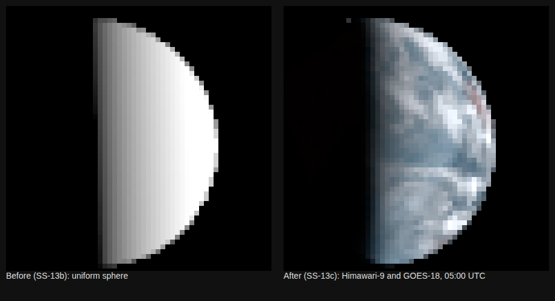

# SS-13c · Earth's real face in the Moon's sky

Status: **in review** · 2026-09-26

As a learner on the Moon, I want Earth to look as it really did at that moment, with its clouds, oceans, continents and blue air, not a plain ball.

## Owner request, 2026-09-26

"The earth in the background is just a ball, we need to emulate real earth details at this distance."

## Why the ball

SS-13b drew Earth as a uniform sphere of the right albedo, lit by the right Sun, until Earth had data of its own (world recipe W8). This story gives it data. The inventory is `docs/data/earth.md`.

## What "this distance" allows

From the Moon, Earth spans 1.9°. In orbit on an iPhone that is about 80 device pixels across, so one pixel is about 150 km of Earth.

So what matters is:
- **Clouds:** where they were at that moment.
- **The surface under them:** ocean, land and ice.
- **The atmosphere:** its blue, and the soft edge it gives the terminator.
- **The terminator** itself.

Relief, rivers and city lights cannot show at this size.

## The products, side by side

Every panel shows Earth as the Moon saw it at the app's first-quarter instant. Each is drawn with the app's own photometry, display = 2 · I/F / r², with no tone mapping (`pipeline/compare_earth_products.py`).

1. **Now:** the uniform sphere.
2. **Blue Marble** (January, cloud-free): an Earth that never exists, since about two-thirds of it is always under cloud.
3. **VIIRS, that day:** the right day's clouds, but each place is imaged at about 13:30 local time, with gaps between orbits. It is a stretched visual product with the atmosphere's blue removed.
4. **Himawari-9 at 05:00 UTC exactly:** calibrated reflectance in three colours. It shows the real clouds at that moment, the atmosphere's blue, and a terminator that softens where the air scatters light.
   - It has data over 98.9% of the lit disc the Moon sees.
   - The dark red is the last 1.1%, beyond Himawari's view.

## Proposal: option 4, measured at the instant

**Source.** The geostationary satellites' own calibrated images at the app's instants (`docs/data/earth.md`):
- Himawari-9 as the primary.
- GOES-18 for Himawari's last 1.1%, cross-calibrated where the two overlap, with the fit recorded.
- For the full-Moon instant's thin crescent, whichever satellite sees it: GOES-19 or EPIC, to evaluate.
- Each place comes from the satellite that sees it most directly, blended across a stated band. Nothing is filled in.

**Colour.** Earth would be the app's first coloured body: red 0.64 µm, green 0.51 µm and blue 0.47 µm, each as measured. The Moon stays as it is.

Himawari's 0.51 µm is bluer than the eye's green, so vegetation looks slightly less green than in a photograph. A published correction that blends in the 0.86 µm band exists. It would be cited in the build, or left out.

**Brightness.** The measured reflectance already includes the Sun's angle, the terminator and the atmosphere. The app shows it as measured: display = exposure · I/F / r², the same rule as for the Moon and the stars, with no ambient light.

**Pipeline.** A new `pipeline:earth` step:
- **Language:** Python, for the bzip2 Himawari files, the NetCDF GOES files and whole-image numpy.
- **Output:** one 2048 × 1024 map per instant (about 20 km per pixel, 8 times finer than the screen needs), stored losslessly, a few MB in all.
- **Sources:** every file is pinned by SHA-256.
- **CI:** the downloads (about 0.6 GB per instant) are too large for it, as with the Moon's source texture. CI instead checks the committed maps, below.

**Orientation.** Earth's rotation at each instant comes from SPICE (`IAU_EARTH`, `pck00011.tpc`). It is written into `ephemeris.json`, which CI already re-derives.

**Honesty.**
- The About text says: "Earth as Himawari-9 and GOES-18 saw it at 05:00 UTC on 26 January 2026".
- The satellites see Earth from a different direction than the Moon does. Reflectance is taken as the same from both directions, which is exact for a matte surface and approximate for sun glint on the ocean and for cloud tops. The About text says that too.

## Checks

- **Unit tests:**
  - The Himawari reader against the fields read from real files: sub-longitude 140.7° E, and calibration gain, offset and albedo coefficient.
  - The geostationary projection round trip.
- **Committed maps** (tested in CI):
  - They go dark where the Sun's cosine reaches 0, to within one map pixel plus twilight.
  - Their mean I/F over the lit disc agrees with Earth's geometric albedo, 0.434, within a tolerance to be stated before it is measured.
  - They have no values where no satellite saw.
- **Captures:** a new close view of Earth from the Moon, with a narrow field so Earth fills it. Its baseline is added in its own commit. `moon-earthrise` changes, with before and after images.
- **Allocation:** the Earth material is shader work only, so no new work in the frame loop.

## Owner decisions, 2026-09-26

1. **Source:** "Satellites at that moment": option 4, Earth as the geostationary satellites measured it at the app's instants.
2. **Colour:** "Yes, colour", as measured in three bands. The Moon stays grey.

## What was built

- **Earth's orientation:** `pipeline/ephemeris.py` now writes `j2000ToEarthFixed`, IAU_EARTH when Earth's light left for the Moon, and Earth's own distance from the Sun. Against JPL Horizons (`test/fixtures/horizons-earth-from-moon.json`), the sub-Moon and sub-solar points on Earth agree within 0.09° in longitude. The latitudes also agree once Horizons' geodetic latitude is converted.
- **The map:** `npm run pipeline:earth` (`pipeline/earth.py`) writes `public/data/earth/first-quarter-2026-01.webp`, 2048 × 1024, 0.7 MB, lossless, with `faces.json`. It holds:
  - Himawari-9 at 05:00 UTC in 0.64 / 0.51 / 0.47 µm;
  - GOES-18 at 05:00 where it saw a place more as the Moon did, put on Himawari's scale by the mirror-geometry fits in `docs/data/earth.md`, with its green from Himawari's own relation (r 0.9996).
  
  Measured over 99.86% of the lit disc the Moon sees. The rest, polar slivers seen by neither within 85°, stays unmeasured and is drawn dark.
- **Blending:** each satellite counts by:
  - how directly it saw a place (full to 65°, gone by 85°);
  - times a Gaussian (σ 30°) of how far its line of sight was from the Moon's;
  - fading inside its own sun glint.
  
  There is no seam.
- **The app:** Earth is an ellipsoid whose rows sit at their geodetic latitude, turned by the ephemeris. It shows the map as measured: display = exposure · I/F / r², no lighting added. The About text says what it is and what it is not.

## Found while building

- **Scattering, not calibration.** Where Himawari and GOES see a place from opposite sides with the Sun low, they differ by up to 2×. In the few places both saw in mirror geometry they agree within 4%. So the satellite whose view was more like the Moon's is preferred, rather than forcing the two to match.
- **Sun glint belongs to the viewer.** GOES shows a glint near 174° E, 15° S that the Moon would not see. The Moon's own glint, near 150° E on the equator, was seen by neither satellite and is not in the data.
- **Himawari's albedo is relative to 1 AU;** GOES's reflectance factor is not. Both are brought to I/F on the day.
- **Earth is not a Lambert sphere.** See the check below. It also means SS-13b's uniform sphere, 1.5 × 0.434 = 0.651, is about twice too bright away from full phase. It remains only for the full-Moon instant, where Earth is a thin crescent.

## Checks, as built

- **Pipeline** (`pipeline/test_earth.py`, in CI):
  - the Himawari reader against a synthetic segment in the claimed layout;
  - a block with a gap stays missing;
  - the sub-satellite point is straight down, at the centre pixel;
  - the far side is unseen, and view zenith grows away from the sub-satellite point;
  - on the committed map, night (the Sun more than 6° down) is dark (99.9th percentile below I/F 0.01) and day is not;
  - over 99.5% of the lit disc the Moon sees is measured;
  - the disc brightness, below.
- **Disc brightness: the reference was changed, for the owner's approval.**
  - **As specified:** a Lambert sphere of the geometric albedo, 0.434, with a 30% tolerance set before measuring. It failed at 49%: that sphere predicted 0.138 in red at this phase, and the map gives 0.070.
  - **Why the reference was wrong:** a Lambert sphere of geometric albedo 0.434 reflects 65% of the sunlight it gets, while Earth reflects 30.6% (its Bond albedo, NASA fact sheet). Earth's phase integral is 0.71, not a Lambert sphere's 1.5, because air and clouds send light back towards the Sun.
  - **Now:** the reference is a Lambert sphere of the Bond albedo, predicting 0.065. The tolerance stays 30%, and the map is 8% above it.
- **Ephemeris** (`pipeline/test_ephemeris.py`): Earth against Horizons, and its rotation is a proper rotation.
- **App** (`src/scenes/earth.test.ts`): every checked texel lands within 1 m of where IAU_EARTH puts its place on the ellipsoid, so the map is neither mirrored nor turned. Earth sits where the ephemeris puts it.
- **Captures:**
  - The new `moon-earth` shows Earth filling a 2.4° view from the Moon.
  - `moon-earthrise` changes, with its baseline in its own commit.

## Not verified

- **Not built:** the full-Moon instant, 2026-01-03 10:00. Earth is a thin crescent then, about half of which only Meteosat saw. That needs a free EUMETSAT account, and its keys would go into the environment's secrets. Until then that instant keeps SS-13b's labelled uniform sphere.
- **Owner's eyes:** how Earth looks on the owner's iPhone.
- **Colour:** vegetation looks brownish, because 0.51 µm is bluer than the eye's green. No published correction is applied.

## Effort

About one working session, most of it spent on the cross-calibration (the scattering finding) and the conventions.
