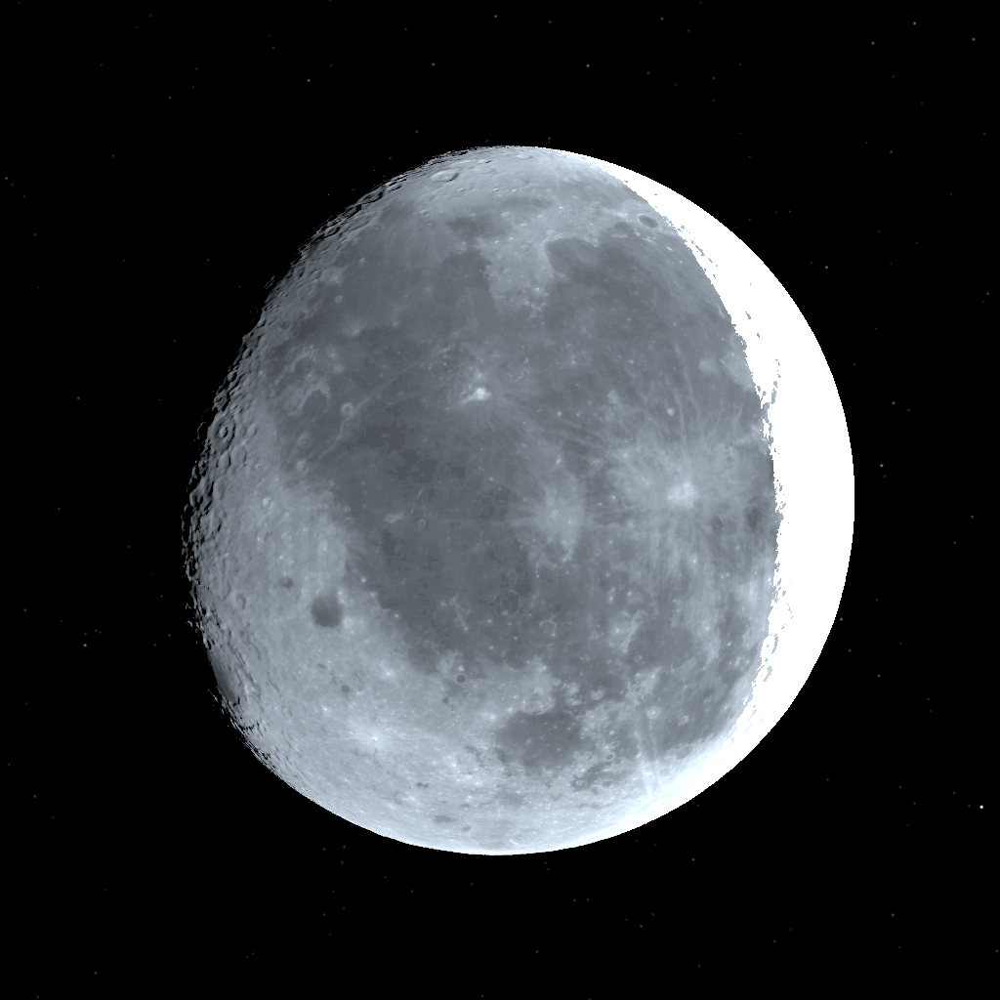

# SS-13e · Earthshine on the Moon's night side

Status: **done** · 2026-09-27

As a learner on the Moon's night side, I want to see it lit by Earth, as the "da Vinci glow" lights a crescent Moon, with Earth's light as the satellites measured it.

## Owner decisions, 2026-09-27

- "What is the next story" was answered with this one, recommended.
- The owner replied: "Yes merge and build the story and merge again". So this spec was approved with the build and merged with it, in one PR.

## The physics, and what it means on screen

**How strong earthshine is.** Earth, seen from the Moon, is a disc of mean radiance factor I/F_disc, averaged over its whole disc, dark part included. On a surface facing it squarely it puts E / F = I/F_disc · (R/d)², with R Earth's radius and d its distance. The derivation is in `core/photometry.ts` `earthshineFactor`, and a unit test integrates the disc numerically.
- At the first-quarter instant, the satellites' map gives I/F_disc = 0.070 / 0.082 / 0.094 in red, green and blue (SS-13c; `public/data/earth/faces.json`, `discIOverFFromMoon`).
- So earthshine is about 1/50,000 of sunlight, bluish, because Earth is.

**How the Moon scatters it.** The Moon scatters Earth's light as it scatters the Sun's: Lommel–Seeliger with Earth's direction in place of the Sun's, times that factor. On terrain, Earth sets behind the horizon over its own angular radius, as the Sun does.

**Why a second exposure.** At the app's sunlit exposure, earthshine is a few millionths of display white (about 5 × 10⁻⁶ for highlands at first quarter). That rounds to black in every pixel: no existing capture changed. That is also true of real photographs, where a camera set for the sunlit Moon shows a black night side. Photographers expose earthshine separately, many stops longer, and the sunlit crescent burns out.

## Decision taken under the owner's instruction to proceed

**Exposure: earthshine.** It is a labelled toggle beside "Stars", 16 stops (×65,536) longer than the sunlit exposure.
- **What it looks like:** earth-lit highlands show at about a third of display white, and anything sunlit is far past white. Stars share the exposure, so they come out, as they do in a real long exposure.
- **The note on screen** says what the setting is.
- **Alternatives:** leaving earthshine physical only, and invisible, would show nothing. A boost of earthshine alone, not of the whole exposure, would be a lighting change no camera makes. Either is a one-line change if the owner prefers it.

## What was built

- `core/photometry.ts`:
  - `earthshineFactor(discIOverF, R, d)` and `EARTHSHINE_EXPOSURE_STOPS`;
  - tests: the formula against a numerical integral over Earth's cone, and the magnitude, 1/30,000 to 1/100,000 of sunlight for a half-lit Earth.
- `pipeline/earth.py`: `disc_i_over_f` records each instant's disc I/F from the map as stored. `test_earth.py` checks the recorded value against the committed map. The map itself is byte-identical.
- `src/scenes/moon.ts`: the earthshine term on the sphere and on terrain, coloured by Earth, and an exposure multiplier.
- `src/scenes/earth.ts`: Earth follows the exposure.
- `src/main.ts`:
  - the "Exposure: sunlight / earthshine" toggle, with the stars following it;
  - About text for both;
  - no earthshine at the full-Moon instant, where Earth's face is not built (SS-13d). Its light falls on the day side then anyway, since the night side is the far side.
- **Capture:** the new `moon-earthshine`, first quarter from over Oceanus Procellarum at the earthshine exposure.

## Checks

- **Unit:** the earthshine factor against numerical integration, and its magnitude. The recorded disc I/F matches the map.
- **Captures:** every existing capture is unchanged, as the physics says it must be at the sunlit exposure. `moon-earthshine` is new.

## Not verified

- **Published earthshine photometry:** the brightness has not been compared with published measurements (for example, Big Bear Solar Observatory's earthshine series). It follows from the satellites' measured Earth and the Moon's photometry alone.
- **Earth's size:** Earth is treated as a point for the Moon's scattering. It spans 1.9°, which changes nothing visible.
- **The owner's iPhone:** how it looks there.

## Effort

Part of one session, 2026-09-27.
