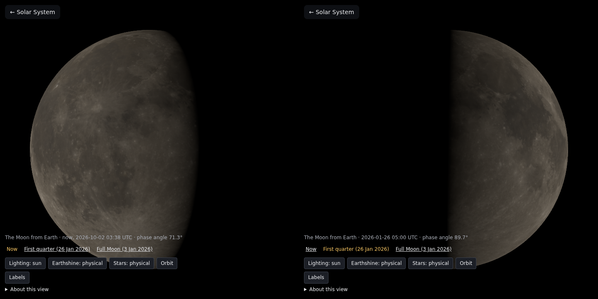

# SS-13f · The Moon now

Status: **built** · 2026-10-02

As a learner, I want the Moon page to open on the Moon as it is right now, so that what I see matches the sky tonight.

## Owner decision, 2026-10-02

- Asked: "Can we use the default as current day? Will that be accurate".
- Chosen: **"Now, Earth plain (Recommended)"**.
  - The page opens at the current moment: real Sun, Earth and Moon positions, phase and shadows.
  - Earth is a plain disc of its measured brightness, labelled, until a later story adds daily satellite images.
  - The two fixed dates stay as choices.
  - Checks stay on fixed dates.

## What changed

**The timeline** (`pipeline/timeline.py`, `npm run pipeline:timeline`; CI re-derives it and diffs it):
- **Samples:** from SPICE, with the same kernels, frames and aberration correction as `ephemeris.py`. Every 12 h from 2026-01-01 to 2031-01-01, plus one sample either side.
- **Each sample holds:**
  - the Sun's and Earth's directions and distances from the Moon;
  - the Moon's rotation into `MOON_ME`;
  - Earth's distance from the Sun.
- **File:** `public/data/moon/timeline.bin`, float32, 263 KB, and `timeline.json`, the layout and the measured errors.
- **The step, chosen by measurement.** A 4-point Lagrange interpolation at 6, 12 and 24 h steps, against SPICE at random moments:

| Step | Earth's direction, worst | Earth's distance | Moon's rotation |
| --- | --- | --- | --- |
| 6 h | 2e-5° | 0.02 km | — |
| 12 h (chosen) | 3.4e-4° | 0.34 km | 6e-6° |
| 24 h | 5e-3° | 5.3 km | — |

At 12 h the worst error is about a hundredth of a pixel of Earth's disc on a phone. The 12 h figures are from 2000 moments, read from the float32 file as the app reads it.

**In the app** (`src/core/timeline.ts`, pure TypeScript):
- **Interpolation:** the same 4-point Lagrange, then directions renormalised and the rotation re-orthonormalised.
- **Earth's turn:** Earth turns half a turn between samples, too fast to interpolate. Its IAU rotation is evaluated from `pck00011.tpc`'s own constants (stored in `timeline.json`), as SPICE does, at the moment its light left for the Moon.
- **Clock:** UTC is turned into TDB by the span's constant offset. There is no leap second in the span as of `naif0012.tls`; the manifest says to re-run if one is announced.
- **The page** (`src/main.ts`):
  - Opens at the moment it loads. The scene is that instant; it does not advance while open.
  - Three choices: **Now**, **First quarter (26 Jan 2026)** (`?epoch=quarter`) and **Full Moon (3 Jan 2026)** (`?epoch=full`). The one shown is highlighted.
  - The caption says "now" with the UTC time.
  - Outside 2026–2030 the page falls back to first quarter and says so.
- **Earth:** at any moment but 26 January 05:00 UTC, Earth is the plain sphere of its measured brightness (geometric albedo 0.434), as the About text says. Earthshine uses that brightness.
- **Captures:** they always use their viewpoint's fixed instant, so no baseline changes.

## Checks

- **`src/core/timeline.test.ts` (new):**
  - At 24 moments between samples, against SPICE (`test/fixtures/moon-timeline-truth.json`, written by the pipeline):
    - Sun and Earth directions, the Moon's rotation axes and the phase angle within 0.002°;
    - Earth's distance within 1 km, the Sun distances within 1 part in a million;
    - Earth's rotation axes within 0.001°.
  - The two fixed epochs are reproduced within 0.002°.
  - The IAU rotation formula is checked against SPICE's `pxform`: 1.2e-6° apart, the light time taken as distance ÷ c (bound 1e-5°).
  - Null outside the span.
  - All the bounds are new, set from the measured errors.
- **Against JPL Horizons, by hand:** for the moment the browser run opened (2026-10-02 03:38 UTC), the page showed phase angle 71.3°. Horizons (`COMMAND='301' CENTER='500@399' QUANTITIES='24'`) gives 71.3101°.
- **Browser run** (headless Chromium, SwiftShader), `ss13f-now-and-quarter.png`: now shows a waning gibbous Moon lit on the left, five days after the 26 September full Moon; `?epoch=quarter` shows the fixed first quarter. No page errors.
- `npm run check`: 185 tests.

## Not verified

- On the owner's iPhone and iPad: the three date choices, and their wrapping on a narrow screen.
- Earth's real face at the current moment: not built. That needs the daily satellite story.
- Time does not run while the page is open. Reloading shows the new moment.
