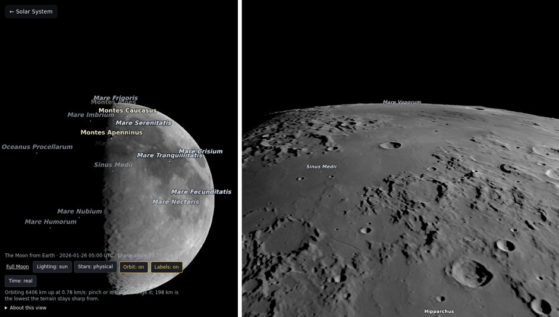

# SS-15 · Landmark labels, and an orbit that starts somewhere worth seeing

Status: **in review** · Release 4 · 2026-09-26

As a learner, I want the famous places named as I fly over them, legible from orbit, fading in and out with the light, and I want orbit mode to start somewhere worth seeing.

## Owner decision, 2026-09-26

"Instead of randomizing the starting orbit, let's fix the best spot first or a known spot and start the orbit there. Lets also add a button to show labels on the popular landmarks. Lets go for the cinematic effect where labels are slowly fading in and out (maybe reacting to sunlight) .. labels should be legible from the orbiting path."

## A known orbit

The Orbit button now always starts over the crater **Albategnius**, heading **due north along its meridian (3.8°E)**. It uses the height the gestures left the camera at, never below the lowest sharp height (SS-11b).

The orbit is the "best spot" because of what it passes and when:
- **Near side:** it crosses the central highlands.
  - Hipparchus, Sinus Medii, Mare Vaporum.
  - The Apennines and Rima Hadley, past the Apollo 15 site.
  - Autolycus, Aristillus, Cassini, Vallis Alpes and the Alps.
- **Far side:** over the north pole, down the far side, and round the south pole.
- **Earthrise:** Earth rises ahead over the south pole (SS-13b).
- **Lighting:** at the app's first-quarter date the Sun stands 8° over Albategnius and lower still further north, so every crater casts long shadows.
- **Unchanged:** `?orbit=<seed>` still flies a random orbit, for the `moon-orbit` capture.

The start's coordinates are the Gazetteer's own, read from `landmarks.json`, not typed in.

## Labels

**Source.** 61 popular landmarks come from the **IAU Gazetteer of Planetary Nomenclature** (USGS, `MOON_nomenclature_center_pts.zip`), read by `tools/data/landmarks.ts`, which is TypeScript with no dependencies:
- 15 maria, 30 craters, 3 mountain ranges, 4 valleys and rilles, and 9 landing sites (Apollo 11, 12, 14, 15, 16 and 17; Chang'e 3, 4 and 5).
- **Hand-chosen:** only which features to show, and the mission name for each landing site. The script fails if the Gazetteer's own "origin" note does not name that mission.
- **Conventions,** from the file's metadata: planetocentric latitude, east-positive longitude (converted from 0–360 to −180–180), sphere of 1737.4 km, datum "Moon 2000".
- **Pin:** the zip's SHA-256 is pinned (retrieved 2026-09-26). The Gazetteer is updated in place, so it differs from the earlier release the albedo fixture pinned. `test/landmarks.test.ts` checks the two agree on every feature both contain.

**How they behave.** Each label is a sprite of fixed on-screen size: 15 CSS px text with a dark halo, and a dot on the spot. Its opacity is computed in the shader every frame, so the frame loop does no work for labels:
- **Rise and set:** labels fade in as their landmark comes over the horizon and out as it sets.
- **Sunlight:** a label dims to 30% on the night side and brightens as the Sun rises there.
- **Prominence:** a feature fades in as it grows from about 2 to 3.5° across as seen from the camera. Landing sites count as 60 km wide.
  - From far out, only the maria and ranges are named.
  - In orbit, craters and landing sites appear as they come near.
- **Toggle:** the Labels button fades them all in or out over 1.5 s, on three's own node clock. It reads three r184's internal `NodeFrame.time`; if a future three moves it, labels switch at once instead.
- **Style:** maria are italic and blue-grey, craters white, mountains and valleys warm grey, landing sites amber.

## Checks

- **Unit tests:**
  - The zip and dBASE readers, on a synthetic archive.
  - The landmarks agree with the pinned Gazetteer fixture, and are unique and in range.
  - The orbit sets off due north: a quarter turn on it is at 78.7°N on the same meridian, at circular speed.
- **Captures:**
  - The new `moon-orbit-labels`: the orbit's start, labels on.
  - Every existing capture is unchanged.
- **Browser run,** in headless Chromium: Orbit starts over Albategnius, Labels turns the labels on, and there are no page errors. SwiftShader draws about one frame a second, so the 1.5 s fade itself could not be watched in the cloud.

## Not verified

- The fades, legibility, and label overlap on the owner's iPhone.
- The frame rate with labels on: 61 sprites, each one draw call.
