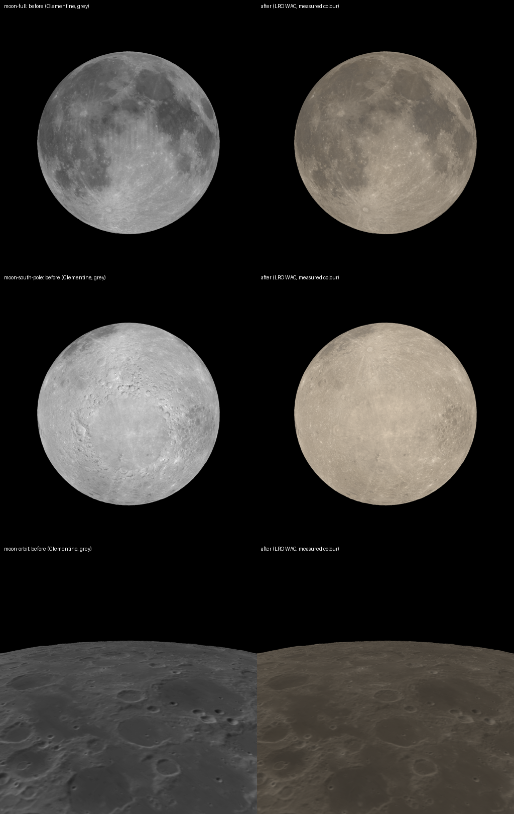

# SS-5b · The Moon's albedo and colour, rebuilt from its inventory

Status: **built** · 2026-09-29

As a learner, I want the Moon's surface drawn from the best of everything measured, not the first product that was found, in its real colour.

## Owner decisions, 2026-09-29

- "Once this is merged proceed to the next story": SS-5b, the next in README's "Next for the Moon".
- After seeing the WAC mosaic beside Clementine (`ss5b-wac-vs-clementine.png`), two choices were asked:
  - **Source:** "Replace with LRO (Recommended)". The WAC Hapke-normalised mosaic replaces Clementine between 70°N and 70°S; LOLA stays near the poles.
  - **Colour:** "Real colour (Recommended)". The Moon is shown in the colour LRO measured, and where none was measured (poleward of 70°) it takes the Moon's average colour, labelled.

## Why Clementine had to go

SS-5 chose Clementine's 750 nm mosaic in 2026-09 because the WAC mosaic that could be reached then (`WAC_morphology_globe`) had shading baked in. The Hapke-normalised mosaic could not be listed from the cloud at the time. It can now: PDS `LRO-L-LROC-5-RDR`, volume `LROLRC_2001`, `DATA/MDR/WAC_HAPKE`.

Beside it, Clementine shows (`ss5b-wac-vs-clementine.png`, 0–90°E, 0–70°N):
- **Shadows baked into craters** at higher latitudes, where its images were taken with the Sun low. Those shadows stay put whatever the Sun does in the app.
- **Vertical stripes** between its image strips.
- **Relative values only:** its label gives no scale to reflectance, so SS-6 and SS-8b had to calibrate it.

The two agree on what is bright and dark: correlation 0.93 over that region.

## The data

**LROC WAC Hapke-normalised mosaic** (WAC_HAPKE). From LROC's product page and each tile's attached PDS3 header and PDS4 label:
- **What it is:** "Photometrically normalized radiance factor (I/F)", "Normalized to the angles of phase (g) = incidence (i) = 60°, emission (e) = 0° by Hapke bidirectional reflectance function" with the Sato et al. (2014) parameter maps. About 124,300 images from 2010 to 2013; each pixel is the median of about 40 months of normalised observations (136–140 in the visible bands).
- **Bands:** 321, 360, 415, 566, 604, 643, 689 nm. Used: 566 nm for brightness; 415, 643 and 689 nm for colour.
- **Layout:** 8 tiles per band, 90° of longitude by 70° of latitude, 146 MB each. IEEE 754 little-endian floats, missing value 0xFF7FFFFB. RECORD_BYTES 27360 and ^IMAGE 2, so the image starts at byte 27360; the PDS4 offset agrees (unlike the parameter maps', SS-8b). 6840 samples by 5321 lines (north) or 5320 (south).
- **Map:** EQUIRECTANGULAR, centre 0°N 0°E, sphere of 1737.4 km, 76 pixels per degree (400 m at the equator), POSITIVE_LONGITUDE_DIRECTION EAST. PROJECTION_LATITUDE_TYPE is PLANETOGRAPHIC, which on a sphere is the planetocentric latitude the app uses.
- **Pixel centres:** from the header's note ("The center of the upper left pixel is defined as line and sample (1.0,1.0)") and its projection offsets. Line L is at latitude (LINE_PROJECTION_OFFSET − (L − 1)) / 76, sample S at longitude ((S − 1) − SAMPLE_PROJECTION_OFFSET) / 76 (`pipeline/wac.py`).
- **Pinned:** all 32 files (`pipeline/wac_sources.json`), MD5 from each label (every one matched), SHA-256 recorded.

## What was built

**Brightness** (`pipeline/moon.py`, `albedo.webp`, 8192 × 4096):
- **Source:** 566 nm I/F at the standard geometry, area-averaged from 76 px/deg (every source pixel counted in the cell its centre falls in, about 11 per cell).
- **Encoding:** byte = 255 √(I/F / 0.25). The source is floating point, and a square-root curve puts the 8 bits where the Moon's values are (median I/F 0.034): about 2% of I/F per step in the maria. No pixel exceeds 0.25, so none is clipped. The rule chose WebP quality 85: 1.14 MB, 43.1 dB.
- **Poles:** LOLA's laser albedo, fitted to the mosaic over 50–60° and blended in from 62° to 70°, where the mosaic ends. The fits improve markedly on the Clementine ones: r 0.90 (north) and 0.89 (south), against 0.77 and 0.73. Shading in Clementine had been part of the mismatch.
- **Gaps:** the mosaic has none within 70° at this resolution, so LOLA's global map now fills nothing.

**Colour** (`albedo-colour.png`, 2048 × 1024, lossless, 2.2 MB):
- **What is stored:** the ratios I/F(643 nm), I/F(415 nm) and I/F(689 nm) to I/F(566 nm), in red, green and blue.
- **Resolution:** colour is 4 times coarser than brightness (5.3 km at the equator), as photographs store it, to keep within the mobile GPU budget. 11 MB with mipmaps, against 128 MB had it been full resolution.
- **Where none was measured:** poleward of 70°, the Moon's median ratios (643/566 1.147, 415/566 0.691, 689/566 1.238), blended in from 62° to 70°.

**Display colour** (`src/core/moonColour.ts`), from each point's ratios:
1. **Spectrum:** linear in wavelength between 415, 566, 643 and 689 nm, flat beyond.
2. **Lighting:** lit by sunlight, a blackbody at 5772 K (IAU 2015 Resolution B3).
3. **To screen colour:** converted with the CIE 1931 colour-matching functions (Wyman et al. 2013 fit, as for the stars) and the IEC 61966-2-1 sRGB matrix.
4. **White balance:** balanced to sunlight, so a surface reflecting every wavelength equally shows grey.

Every step is linear in the ratios, so each display channel is a fixed weighted sum of them, computed once and used by the shader. Brightness stays I/F at 566 nm; colour is only the tint.

**Photometry:**
- **Standard geometry:** the Hapke standard geometry is now the mosaic's, i = g = 60°, e = 0 (`core/hapke.ts` `MAP_STANDARD_DEG`). The renderer draws I/F = map I/F × Hapke(i, e, g; tile) / Hapke(60°, 0°, 60°; tile): exactly the inverse of the normalisation LRO applied, with the same parameter maps.
- **No scale is fitted any more:** the mosaic is absolute. `pipeline/calibrate.py` became a consistency record instead: per 1° tile, the mosaic's mean against the I/F the tile's own Hapke parameters give at the standard geometry. Result: slope 0.964, r 0.988, relative RMS 3.8% over 50,400 tiles. Two products of the same observations agree, which also confirms that reading, placing and decoding both are right.

**Removed:** the "Scattering: old" comparison button from SS-8b. It drew the old model with Clementine's calibration, which no longer exists.

## Checks

- **Pipeline tests** (`npm run pipeline:test`, 64): the encoding round trip and its precision; the new 62–70° blend.
  - The texture tests now compare reflectance, decoding the square-root curve. Without that, the mirrored-map check failed, because in stored levels every contrast is roughly its square root. That corrects what the test measures, not its threshold.
  - The blend-step check stays in stored grey levels, as written for SS-6b, because its "+ 1.0" slack is one grey level.
- **Colour unit tests** (`src/core/moonColour.test.ts`): a flat spectrum shows as exact grey; the interpolation is linear and flat beyond the bands; the Moon's median spectrum shows warm (red > green > blue).
- **The Moon's colour against observation, not a CI check.** From the median ratios, the Moon reddens sunlight by 0.26 to 0.29 magnitudes in B − V. The spread depends on the effective wavelengths assumed for B and V (442/540 nm or 440/550 nm). Thejll et al. (2014, A&A, doi:10.1051/0004-6361/201322776) measured the sunlit Moon at B − V = 0.90 ± 0.01, a reddening of 0.26 against the Sun's 0.64. The warm grey on screen is the Moon's measured colour.
- **Captures:**
  - The photometry checks pass unchanged: the uniform Moons have no colour and their tolerance is unchanged.
  - The negative controls fail as they must, the mirrored Moon included.
  - The Gazetteer checks pass on the new map.
  - 16 Moon views change and are re-accepted in their own commit.
- `npm run check`: 175 tests, bundle 257.5 KB of 400 KB.

## What changes on screen

- The Moon is warm grey, with maria faintly browner or bluer by composition. The colour is subtle and measured.
- No shadows are baked into the map, visible most at high latitudes and at the south pole, and no Clementine stripes.
- Brightness is LRO's absolute measurement, consistent with the lighting model.

## Not verified

- On the owner's iPhone: the colour's look, and memory. The colour texture adds 11 MB on the GPU, with the 32 MB albedo and 1 MB of Hapke parameters.
- The colour's fidelity per point. Only the disc average was compared with observation.
- Phase reddening: the Moon reddens at larger phase angles. The same 566 nm Hapke parameters are used for every band, so this is not modelled; the other bands' parameter maps would add it.
- Kaguya's Multiband Imager, and the LOLA polar DEMs for elevation: still on the inventory's "to evaluate" list.

## Effort

One session, 2026-09-29.
