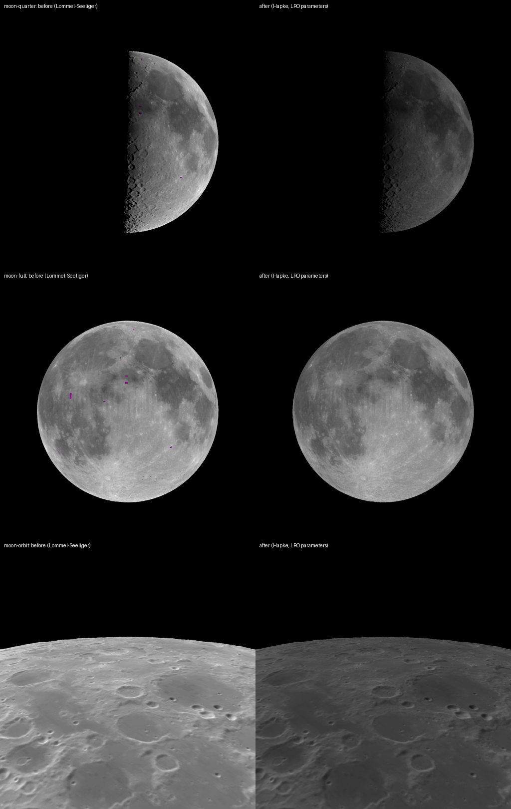

# SS-8b · Hapke scattering, from LRO's measurements

Status: **done** · merged 2026-09-29 (PR #37)

As a learner, I want the Moon to scatter light the way its regolith really does, so that it brightens sharply towards full and the quarter Moon is as dim as the real one.

## Owner decisions, 2026-09-28

- The owner asked for "the next story". SS-8b was chosen because the Moon's phase curve was the most visible photometric error left (SS-6: about twice too bright at quarter phase). SS-5b's best candidate map, the LROC WAC Hapke-normalised mosaic, also needs this model to be drawn right.
- For the owner to approve in the PR: the new phase-curve check and its tolerance, and the median parameters used poleward of 70°. Both are described below.

## What was wrong

SS-6 shaded the Moon with Lommel–Seeliger, one effective albedo per point, calibrated so the disc at zero phase had the fact sheet's geometric albedo 0.12. That model has no opposition surge and scatters too much light at large phase angles. SS-6 recorded the consequence: the quarter Moon came out about twice as bright as the real one.

- 2026-09-29, after the approval points were set out: "I can only load this on my phone and observe so we might need to merge this, tell me exact steps i should do or add a button so i can click and validate what we built." Merged on that basis, and a labelled **Scattering: Hapke / old** button added so the result can be judged on the phone.

## The comparison button

**Scattering: old** draws the model used before this story, Lommel–Seeliger with SS-6's calibration (ϖ = 7.92177 per texture unit, `albedo.json` at 30d1667), in place of Hapke's sunlit term. It is off by default and in every capture. While it is on, a note says it is the old model, shown only to compare. Even lighting and earthshine stay Hapke.

## The data

**LROC WAC Hapke photometric parameter maps** (Sato, Robinson, Hapke, Denevi and Boyd 2014, "Resolved Hapke parameter maps of the Moon", JGR Planets 119, 1775–1805, doi:10.1002/2013JE004580; PDS `LRO-L-LROC-5-RDR`, volume `LROLRC_2001`, `DATA/SDP/WAC_HAPKEPARAMMAP`, product v1.1).
- About 66,000 WAC observations, February 2010 to October 2011, fitted per 1° × 1° tile, 70°N to 70°S.
- Fitted per tile: w (single-scattering albedo), b and c (double Henyey-Greenstein phase function), Bs0 and hs (shadow-hiding opposition surge).
- Fixed for every tile: roughness θ̄ = 23.657°, no coherent backscatter (Bc0 = 0).
- Band used: 566 nm, the WAC band nearest the V band the display's brightness is expressed in.
- Conventions, from the product's attached PDS3 header and PDS4 label: equirectangular, planetocentric, east-positive, 1737.4 km sphere, 1 pixel per degree; the centre of line 1, sample 1 is at 69.5°N, 0.5°E.

**A label error, found and worked around.** The PDS4 label says the image starts at byte 1440. Read from there, every band is shifted: w comes out as 10³³, and θ̄ lands in the φ band.
- The attached PDS3 header (RECORD_BYTES 1440, LABEL_RECORDS 4, ^IMAGE 5) says byte 5760.
- The file size is exactly 5760 bytes plus the image.
- Read from 5760, every band holds plausible values, and the fixed bands are constant as the README says.
- `tools/data/hapke.ts` follows the header and refuses the file if the header changes.

**A README discrepancy.** The README says the filling factor φ is fixed at 1.0; the archived band holds 0.0. The porosity factor K is 1 under either reading, which is how the model here uses it.

**227 tiles have hs = 0**: the fitted surge is narrower than the data resolve. They are kept as measured; the model floors hs at 10⁻⁶ to stay finite, which leaves them with no surge except at exactly zero phase.

## The model

Hapke (2012), the form the parameters were fitted with (`src/core/hapke.ts`):

I/F = (w/4) · μ0e/(μ0e + μe) · [p(g) · B_SH(g) + H(μ0e) · H(μe) − 1] · S(i, e, ψ)

- **p(g):** double Henyey-Greenstein, with b and c.
- **B_SH(g) = 1 + Bs0 / (1 + tan(g/2)/hs):** the opposition surge.
- **H:** Hapke's (2002) approximation to Chandrasekhar's H function.
- **S, μ0e and μe:** Hapke's (1984) macroscopic roughness.

It is mirrored in TSL (`src/scenes/hapkeNode.ts`) without branches: both of the roughness model's cases (i ≤ e and e ≤ i) are evaluated, and one is kept with `step`/`mix`.

## How the map and the model combine

Clementine's mosaic is reflectance at one standard geometry: "normalized to R30, the reflectance expected at an incidence angle (i) and phase angle (p) of 30.0 degrees and an emission angle (e) of 0.0 degrees" (Clementine UVVIS mosaic volume, VOLINFO.HTM, section 8). Its scale is relative. So each point is drawn as:

I/F = k · v(x) · Hapke(i, e, g; tile) / Hapke(30°, 0°, 30°; tile)

- **v(x):** the map at 118 m, the spatial detail.
- **The ratio:** the tile's own angular behaviour, measured by LRO.
- **k:** the absolute scale, a cross-calibration (`pipeline/calibrate.py`). It is the least-squares fit, through zero, of each tile's WAC I/F at the standard geometry against the tile's mean map value, over all 50,400 tiles.
  - Result: k = 0.5229, r = 0.959, relative RMS residual 9.2%.
  - A fit with an offset gives slope 0.415 and offset 0.018. It is reported beside the used fit and not used: an offset would add light that neither instrument measured.
  - The residual is expected: 750 nm (Clementine) and 566 nm (WAC) differ in contrast between mare and highland.

**Poleward of 70°** the product has no tiles. Those rows of the parameter texture hold the median of every tile's parameters. Linear filtering blends them with the last measured row over 1°.
- The albedo there is still measured (LOLA, SS-6b). Only how it scatters with angle takes the Moon's typical values.
- The About text says so.
- For the owner to approve.

**Uniform Moons**, used by the photometry checks, get the median tile's parameters and its I/F at the standard geometry, 0.0832.

## Checks

**Unit tests** (`src/core/hapke.test.ts`):
- **Reciprocity:** the reflectance r/μ0 is unchanged when Sun and viewer swap, to 12 digits, at five geometries. This proves both roughness branches were ported correctly, since swapping swaps branches.
- **H function:** H(1) for conservative scattering is within 1% of Chandrasekhar's 2.90781, the accuracy Hapke claims for his approximation.
- **Phase function:** the double Henyey-Greenstein function integrates to 1 over the sphere.
- **Surge:** the surge is 1 + Bs0 at zero phase and halves over hs.
- **Zeros:** zero where the Sun is down or the surface faces away.

**The whole Moon against observation** (`test/moon-phase-curve.test.ts`). Every tile's absolute Hapke I/F, from its own w, is summed over the disc facing Earth. The result is compared with the Moon's phase curve from Allen's Astrophysical Quantities, 4th ed. (Cox 2000): m(α) = −12.73 + 0.026|α| + 4 × 10⁻⁹ α⁴.
- This shares nothing with LRO, and the albedo map plays no part.
- Zero phase is the fact sheet's geometric albedo 0.12.
- Tolerance: 0.25 mag from 10° to 120°. **It was chosen after seeing the comparison, not before.** The largest difference is 0.20 mag, at 120°. For the owner to approve.

| Phase | Hapke, WAC tiles | Allen | Difference |
| --- | --- | --- | --- |
| 10° | 0.245 | 0.260 | −0.015 |
| 30° | 0.766 | 0.783 | −0.017 |
| 60° | 1.513 | 1.612 | −0.099 |
| 90° | 2.440 | 2.602 | −0.162 |
| 120° | 3.746 | 3.949 | −0.203 |

Magnitudes are relative to geometric albedo 0.12 at zero phase.
- The model is slightly bright at large phase angles.
- At zero phase it gives geometric albedo 0.168: the opposition surge, which Allen's formula leaves out. That formula is fitted to observations that cannot reach zero phase, because the Earth's shadow is there.

**The same curve for what the app draws.** This is the Clementine map times the ratio above, and it is not a CI check: Node has no WebP decoder. It was computed with the pipeline's Python while designing:

| Phase | App | Allen | Difference |
| --- | --- | --- | --- |
| 5° | 0.127 | 0.130 | −0.003 |
| 20° | 0.619 | 0.521 | +0.098 |
| 45° | 1.200 | 1.186 | +0.014 |
| 90° | 2.503 | 2.602 | −0.099 |
| 120° | 3.801 | 3.949 | −0.148 |

Before this story, Lommel–Seeliger was about 0.75 mag (a factor of 2) too bright at 90°.

**Captures:**
- The photometry captures (`uniform-ls-full`, `uniform-ls-quarter`, `uniform-even-far` and `uniform-relief-full`; ids kept from SS-6) check the shader against `core/hapke.ts` pixel by pixel, within 2 levels, as before; their tolerance is unchanged.
- The negative controls still fail as they must.
- Every Moon capture changes, because the Moon now scatters differently. Baselines are in their own commit, with before-and-after images.

**Data:** `npm run pipeline:hapke` re-derives the parameter texture from the pinned product (MD5 from the label, SHA-256 pinned), and CI diffs it. `pipeline:calibrate` re-derives k.

## What changes on screen

- The quarter Moon is about half as bright as before, as dim as the real one.
- The full Moon brightens sharply in the last few degrees before opposition.
- Towards the terminator, brightness falls off more gradually, and rough ground darkens it as it does on the real Moon.
- At exact zero phase the brightest 0.01% of texels (fresh crater rays) would pass display white. The brightest whole 1° tile stays at 0.84 of white.

## Not verified

- On the owner's iPhone: the look, and the cost of the heavier shader. Hapke runs up to three times per pixel: Sun, even lighting, and earthshine.
- The rendered disc's phase curve, by CI (above).
- Other WAC bands. Only 566 nm is used, for a grey Moon. Colour would use the other six bands (and would start SS-5b).

## Effort

One session, 2026-09-28.
